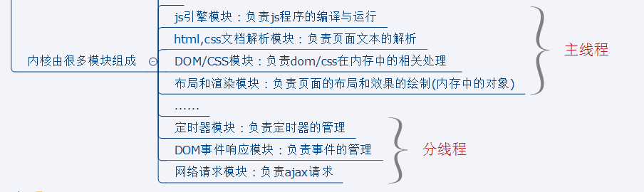
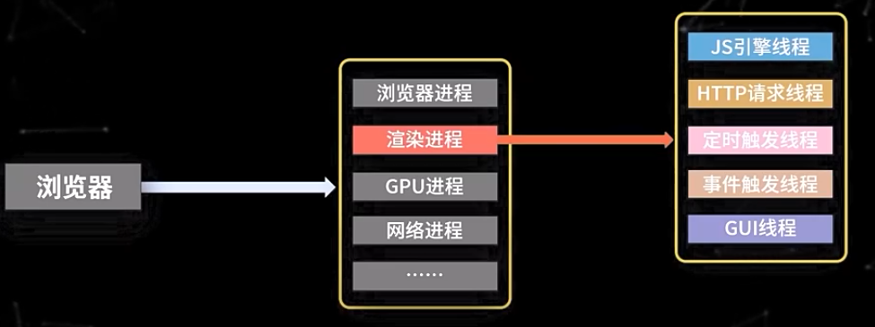
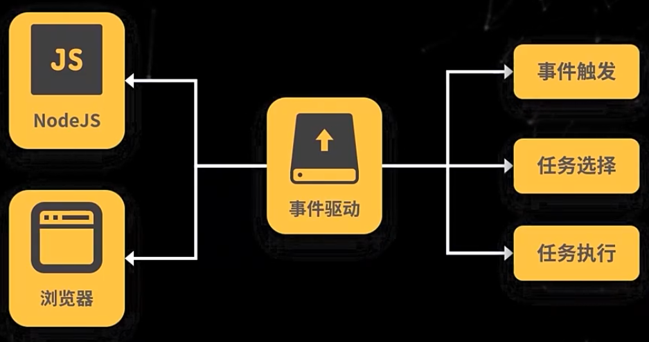
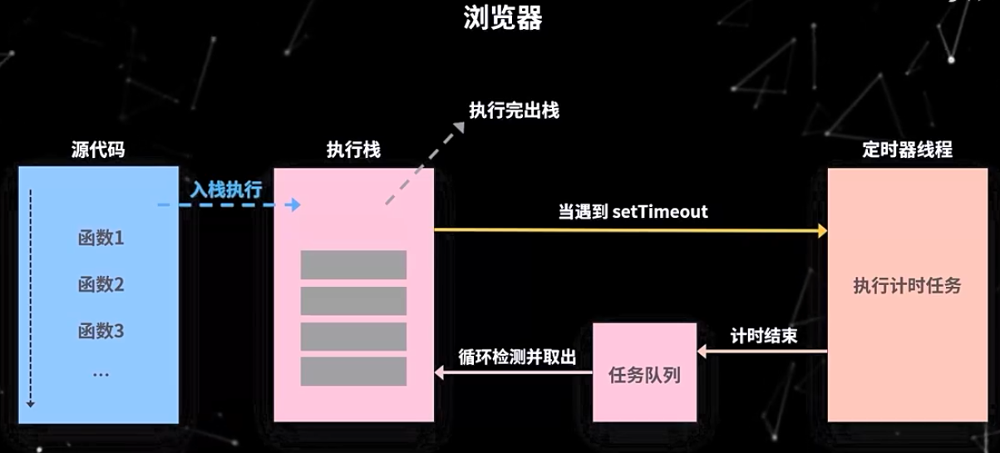
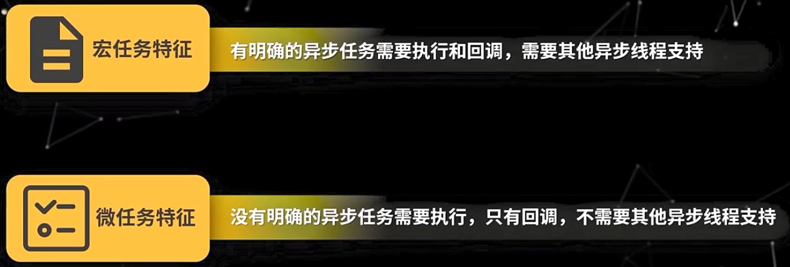

# JS高级

## 四、原型与原型链


### 1. 对原型、原型链的理解

在js中是使用构造函数来新建一个对象的，每个构造函数内部都有一个`prototype`属性，是一个对象，包含构造函数的所有属性和方法。当实例化对象后，对象的隐式原型属性会指向构造函数的显式原型属性。可使用Object.getPrototypeOf()来获取隐式原型属性。


当访问一个对象的属性时，如果这个对象内部不存在这个属性，那么就会沿着隐式原型去找，其实这就是`instanceof`的原理，根据原型链判断构造函数是否在实例对象的隐式原型链上。原型链的尽头一般来说都是`Object.prototype`，所以这也是为什么实例对象能使用`toString()`等方法的原因。

**特点：**js对象是通过引用来传递的，创建的每个实例对象中没有一份属于自己的原型副本。当修改原型时，与之相关的对象也会继承这一改变。

### 2. 原型修改、重写

```js
function Person(name) {
    this.name = name
}
// 修改原型
Person.prototype.getName = function() {}
var p = new Person('hello')
console.log(p.__proto__ === Person.prototype) // true
console.log(p.__proto__ === p.constructor.prototype) // true
// 重写原型
Person.prototype = {
    getName: function() {}
}
var p = new Person('hello')
console.log(p.__proto__ === Person.prototype)        // true
console.log(p.__proto__ === p.constructor.prototype) // false
console.log(p.constructor.prototype === Object.prototype);  // true
// 要想成立，就要用constructor指回来
p.constructor = Person
console.log(p.__proto__ === p.constructor.prototype); // true
```

### 3. 原型链指向

```js
p.__proto__		// Person.prototype
Person.prototype.__proto__	// Object.prototype
p.__proto__.__proto__		// Object.prototype
p.__proto__.constructor		// Person
p.__proto__.constructor.__prototype.__proto__	// Object prototype
Person.prototype.constructor	// Object
Person.prototype.constructor.prototype	// Object.prototype
Person.prototype.constructor.prototype.__proto__	// Object.prototype.proto	null
P1.__proto__.constructor 	// Person
Person.prototype.constructor 	// Person
```

### 4. 原型链的终点是什么？如何打印出原型链的终点？

```js
Object.prototype.__proto__     null
```

### 5. 如何获得对象非原型链上的属性？

使用**`hasOwnProperty()`**判断属性是否属于原型链的属性：

判断对象自身属性中是否具有指定的属性

即使属性的值是 `null` 或 `undefined`，只要属性存在，`hasOwnProperty` 依旧会返回 `true`

## 五、执行上下文/作用域链/闭包

### 闭包

#### 1. 对闭包的理解

**闭包是指有权访问另一个函数作用域中变量的函数**，创建闭包的最常见的方式就是在一个函数内创建另一个函数，创建的函数可以访问到当前函数的局部变量。

闭包有两个常用的用途；

- 闭包的第一个用途是使我们在函数外部能够访问到函数内部的变量。通过使用闭包，可以通过在外部调用闭包函数，从而在外部访问到函数内部的变量，可以使用这种方法来创建私有变量。
- 闭包的另一个用途是使已经运行结束的函数上下文中的变量对象继续留在内存中，因为闭包函数保留了这个变量对象的引用，所以这个变量对象不会被回收。

比如，函数 A 内部有一个函数 B，函数 B 可以访问到函数 A 中的变量，那么函数 B 就是闭包。

```js
function A() {
  let a = 1
  window.B = function () {
      console.log(a)
  }
}
A()
B() // 1
```

在 JS 中，闭包存在的意义就是让我们可以间接访问函数内部的变量。经典面试题：循环中使用闭包解决 var 定义函数的问题

```js
for (var i = 1; i <= 5; i++) {
  setTimeout(function timer() {
    console.log(i)
  }, i * 1000)
}
```

首先因为 `setTimeout` 是个异步函数，所以会先把循环全部执行完毕，这时候 `i` 就是 6 了，所以会输出一堆 6。解决办法有三种：

- 第一种是使用闭包的方式

```js
for (var i = 1; i <= 5; i++) {
    (function(j){
        setTimeout(function timer() {
            console.log(j);
        })
    })(i)
}
```

在上述代码中，首先使用了立即执行函数将 `i` 传入函数内部，这个时候值就被固定在了参数 `j` 上面不会改变，当下次执行 `timer` 这个闭包的时候，就可以使用外部函数的变量 `j`，从而达到目的。

- 第二种就是使用 `setTimeout` 的第三个参数，这个参数会被当成 `timer` 函数的参数传入。

```js
for (var i = 1; i <= 5; i++) {
  setTimeout(
    function timer(j) {
      console.log(j)
    },
    i * 1000,
    i
  )
}
```

- 第三种就是使用 `let` 定义 `i` 了来解决问题了，这个也是最为推荐的方式

```js
for (let i = 1; i <= 5; i++) {
  setTimeout(function timer() {
      console.log(i)
    },
    i * 1000)
}
```

#### 2. 闭包的作用

定义JS模块

- 具有特定功能的js文件
- 将所有的数据和功能都封装在一个函数内部(私有的)
- 只向外暴露一个包含n个方法的对象或函数
- 模块的使用者，只需要通过模块暴露的对象调用方法来实现功能

#### 3. 闭包的缺点

- 函数执行完后，函数内的局部变量没有释放，占用内存时间会变长
- 容易造成内存泄漏

**解决**

- 能不用闭包就不用
- 及时释放

```js
function fn1(){
    var arr = new Array(100000)
    function fn2(){
        console.log(arr.length);
    }
    return fn2
}
var f = fn1()
f()
f = null // 让内部函数成为垃圾对象 --> 回收闭包
```

### 作用域与作用域链

#### 1）全局作用域和函数作用域

（1）全局作用域

- 最外层函数和最外层函数外面定义的变量拥有全局作用域
- 所有未定义直接赋值的变量自动声明为全局作用域
- 所有window对象的属性拥有全局作用域
- 全局作用域有很大的弊端，过多的全局作用域变量会污染全局命名空间，容易引起命名冲突。

（2）函数作用域

- 函数作用域声明在函数内部的变零，一般只有固定的代码片段可以访问到
- 作用域是分层的，内层作用域可以访问外层作用域，反之不行

#### 2）块级作用域

- 使用ES6中新增的let和const指令可以声明块级作用域，块级作用域可以在函数中创建也可以在一个代码块中的创建（由`{ }`包裹的代码片段）
- let和const声明的变量不会有变量提升，也不可以重复声明
- 在循环中比较适合绑定块级作用域，这样就可以把声明的计数器变量限制在循环内部。

**作用域链：** 在当前作用域中查找所需变量，但是该作用域没有这个变量，那这个变量就是自由变量。如果在自己作用域找不到该变量就去父级作用域查找，依次向上级作用域查找，直到访问到window对象就被终止，这一层层的关系就是作用域链。

作用域链的作用是**保证对执行环境有权访问的所有变量和函数的有序访问，通过作用域链，可以访问到外层环境的变量和函数。**


作用域链的本质上是一个指向变量对象的指针列表。变量对象是一个包含了执行环境中所有变量和函数的对象。作用域链的前端始终都是当前执行上下文的变量对象。全局执行上下文的变量对象（也就是全局对象）始终是作用域链的最后一个对象。

查找一个变量时，如果当前执行环境中没有找到，可以沿着作用域链向后查找。

### 对执行上下文的理解

#### 1. 执行上下文类型

**（1）全局执行上下文**

任何不在函数内部的都是全局执行上下文，它首先会创建一个全局的window对象，并且设置this的值等于这个全局对象，一个程序中只有一个全局执行上下文。

**（2）函数执行上下文**

当一个函数被调用时，就会为该函数创建一个新的执行上下文，函数的上下文可以有任意多个。

**（3）**`eval`**函数执行上下文**

执行在eval函数中的代码会有属于他自己的执行上下文，不过eval函数不常使用，不做介绍。

#### 2. 执行栈(Execution Context Stack)

- JavaScript引擎使用执行上下文栈来管理执行上下文
- 当JavaScript执行代码时，首先遇到全局代码，会创建一个全局执行上下文并且压入执行栈中，每当遇到一个函数调用，就会为该函数创建一个新的执行上下文并压入栈顶，引擎会执行位于执行上下文栈顶的函数，当函数执行完成之后，执行上下文从栈中弹出，继续执行下一个上下文。当所有的代码都执行完毕之后，从栈中弹出全局执行上下文。

- 后进先出


#### 3. 创建执行上下文

创建执行上下文有两个阶段：**创建阶段**和**执行阶段**

**1）创建阶段**

（1）this绑定

- 在全局执行上下文中，this指向全局对象（window对象）
- 在函数执行上下文中，this指向取决于函数如何调用。如果它被一个引用对象调用，那么 this 会被设置成那个对象，否则 this 的值被设置为全局对象或者 undefined

（2）创建词法环境组件

- 词法环境是一种有**标识符——变量映射**的数据结构，标识符是指变量/函数名，变量是对实际对象或原始数据的引用。
- 词法环境的内部有两个组件：**加粗样式**：环境记录器:用来储存变量个函数声明的实际位置**外部环境的引用**：可以访问父级作用域

（3）创建变量环境组件

- 变量环境也是一个词法环境，其环境记录器持有变量声明语句在执行上下文中创建的绑定关系。

**2）执行阶段** 此阶段会完成对变量的分配，最后执行完代码。

**简单来说执行上下文就是指：**

在执行一点JS代码之前，需要先解析代码。解析的时候会先创建一个全局执行上下文环境，先把代码中即将执行的变量、函数声明都拿出来，变量先赋值为undefined，函数先声明好可使用。这一步执行完了，才开始正式的执行程序。

在一个函数执行之前，也会创建一个函数执行上下文环境，跟全局执行上下文类似，不过函数执行上下文会多出this、arguments和函数的参数。

- 全局上下文：变量定义，函数声明
- 函数上下文：变量定义，函数声明，`this`，`arguments`

#### 4种情况会创建新的执行上下文

- **进入全局代码**
- **进入function函数体代码**
- 进入eval函数参数指定的代码
- 进入module代码

**1. var和function声明创建在全局对象中，而let const class声明的变量创建在全局scope（词法环境）中**

**2. 先到全局scope（词法环境）中找变量（let/const定义的），找不到再到全局对象中查找**

**3. let const class声明的名称不能重复**

**4. let const class 和 var function的名字不能重复**

**5. var 和 function名字重复的，function声明的函数名优先（函数提升优先，后执行）**


顶级函数在全局对象上创建时，函数对象‘体内’会保存函数创建时的执行上下文的文本环境


+ 全局执行上下文一般由浏览器创建，代码执行时就会创建；函数执行上下文只有函数被调用时才会创建，调用多少次函数就会创建多少上下文。
+ 调用栈用于存放所有执行上下文，满足FILO规则。
+ 执行上下文创建阶段分为绑定this，创建词法环境，变量环境三步，两者区别在于词法环境存放函数声明与const let声明的变量，而变量环境只存储var声明的变量。
+ 词法环境主要由环境记录与外部环境引入记录两个部分组成，全局上下文与函数上下文的外部环境引入记录不一样，全局为null，函数为全局环境或者其它函数环境。环境记录也不一样，全局叫对象环境记录，函数叫声明性环境记录。
+ 你应该明白了为什么会存在变量提升，函数提升，而let const没有。
+ ES3之前的变量对象与活动对象的概念在ES5之后由词法环境，变量环境来解释，两者概念不冲突，后者理解更为通俗易懂。


**在函数定义时，会创建一个作用域链，这个是会包含全局或者嵌套父函数的作用链，这是已经固定了的。但是当这个定义完的函数执行时，会生成执行上下文，然后其中包含了新的作用域链，这是一条在之前基础上，新的作用域链。**

**首先创建全局执行上下文，创建过程中同时创建全局词法环境，将全局执行上下文加入上下文栈顶，收集变量或函数，var初始化为undefined，let/const不做初始化处理，function初始化为function，当函数调用时，函数体代码执行前，会创建函数执行上下文，在创建函数执行上下文的同时，创建函数词法环境，然后执行代码。**

## 六、this/call/apply/bind

### 1. 对this对象的理解

this是执行上下文中的一个属性，指向最后一次调用这个方法的对象。

可以通过四种调用模式判断。

+ **函数调用模式**，当一个函数不是一个对象的属性时，直接作为函数调用，this指向全局对象。
+ **方法调用模式**，如果一个函数作为一个对象的方法来调用时，this指向这个对象。
+ **构造器调用模式**，如果一个函数用new调用时，函数执行前会新创建一个新对象，this指向这个新创建的对象。
+ **apply、call、bind调用模式**，这三个方法都可以显示的指定调用函数的 this 指向。
  + apply方法接收两个参数：一个是this绑定的对象，一个是参数数组。
  + call方法接收的参数：第一个是this绑定的对象，后面的其余参数是传入函数执行的参数。也就是说，在使用call()方法时，传递给函数的参数必须逐个列举出来
  + bind方法通过传入一个对象，返回一个this绑定了传入对象的新函数。这个函数的this指向除了使用new时会被改变，其他情况下都不会改变。

构造器调用模式的优先级最高，然后时apply、call、bind调用模式，然后是方法调用模式，然后是函数调用模式。

### 2. call() 和 apply() 的区别？

作用一模一样，区别在于传入参数的形式的不同。

- apply接受两个参数，第一个参数指定了函数体内this对象的指向，第二个参数为一个带下标的集合，这个集合可以为数组，也可以为类数组，apply方法把这个集合中的元素作为参数传递给被调用的函数。
- call传入的参数数量不固定，跟apply相同的是，第一个参数也是代表函数体内的this指向，从第二个参数开始往后，每个参数被依次传入函数。

### 3. 实现call、apply 及 bind 函数

**（1）call 函数的实现步骤：**

- 判断调用对象是否为函数，即使是定义在函数的原型上的，但是可能出现使用call等方法调用的情况
- 判断传入上下文对象是否存在，如果不存在，则设置为window
- 处理传入的参数，截取第一个参数后的所有参数
- 使用函数作为上下文对象的一个属性
- 使用上下文对象来调用这个方法，并保存返回结果
- 删除刚才新增的属性
- 返回结果

```js
Function.prototype.myCall = function(context) {
  // 判断调用对象
  if (typeof this !== "function") {
    console.error("type error");
  }
  // 获取参数
  let args = [...arguments].slice(1),
    result = null;
  // 判断 context 是否传入，如果未传入则设置为 window
  context = context || window;
  // 将调用函数设为对象的方法
  context.fn = this;
  // 调用函数
  result = context.fn(...args);
  // 将属性删除
  delete context.fn;
  return result;
};
```

**（2）apply 函数的实现步骤：**

- 判断调用对象是否为函数，即使是定义在函数的原型上的，但是可能出现使用call等方法调用的情况
- 判断传入上下文对象是否存在，如果不存在，则设置为window
- 使用函数作为上下文对象的一个属性
- 判断参数值是否传入
- 使用上下文对象来调用这个方法，并保存返回结果
- 删除刚才新增的属性
- 返回结果

```js
Function.prototype.myApply = function(context) {
  // 判断调用对象是否为函数
  if (typeof this !== "function") {
    throw new TypeError("Error");
  }
  let result = null;
  // 判断 context 是否存在，如果未传入则为 window
  context = context || window;
  // 将函数设为对象的方法
  context.fn = this;
  // 调用方法
  if (arguments[1]) {
    result = context.fn(...arguments[1]);
  } else {
    result = context.fn();
  }
  // 将属性删除
  delete context.fn;
  return result;
};
```

**（3）bind 函数的实现步骤：**

- 判断调用对象是否为函数，即使是定义在函数的原型上的，但是可能出现使用 call 等方式调用的情况。
- 保存当前函数的引用，获取其余传入参数值。
- 创建一个函数返回
- 函数内部使用apply来绑定函数调用，需要判断函数作为构造函数的情况，这个时候需要传入当前函数的this给apply调用，其余情况都传入指定的上下文对象。

```js
Function.prototype.myBind = function(context) {
  // 判断调用对象是否为函数
  if (typeof this !== "function") {
    throw new TypeError("Error");
  }
  // 获取参数
  var args = [...arguments].slice(1),
    fn = this;
  return function Fn() {
    // 根据调用方式，传入不同绑定值
    return fn.apply(
      this instanceof Fn ? this : context,
      args.concat(...arguments)
    );
  };
};
```

## 七、异步编程

### 1. 异步编程的实现方式？

JavaScript中的异步机制可以分为以下几种：

- **回调函数**，多个回调函数嵌套的时候会造成回调函数地狱，上下两层的回调函数间的代码耦合度太高，不利于代码的可维护。
- **Promise**，使用 Promise 的方式可以将嵌套的回调函数作为链式调用。
- **generator**，它可以在函数的执行过程中，将函数的执行权转移出去，在函数外部还可以将执行权转移回来。当遇到异步函数执行的时候，将函数执行权转移出去，当异步函数执行完毕时再将执行权给转移回来。

- **async 函数** ，，async 函数是 generator 和 promise 实现的一个自动执行的语法糖，它内部自带执行器，当函数内部执行到一个 await 语句的时候，如果语句返回一个 promise 对象，那么函数将会等待 promise 对象的状态变为 resolve 后再继续向下执行。

### 2. setTimeout、Promise、Async/Await 的区别

#### （1）setTimeout

```js
console.log('script start')	//1. 打印 script start
setTimeout(function(){
    console.log('settimeout')	// 4. 打印 settimeout
})	// 2. 调用 setTimeout 函数，并定义其完成后执行的回调函数
console.log('script end')	//3. 打印 script start
// 输出顺序：script start->script end->settimeout
```

#### （2）Promise

Promise本身是**同步的立即执行函数**， 当在executor中执行resolve或者reject的时候, 此时是异步操作， 会先执行then/catch等，当主栈完成后，才会去调用resolve/reject中存放的方法执行，打印p的时候，是打印的返回结果，一个Promise实例。

```js
console.log('p1');
let promise = new Promise((resolve, reject) => {
    console.log('p2');
    resolve()
    console.log('p3');
}).then(() => {
    console.log('p4')
}).catch(()=> console.log('p5'))

setTimeout(()=>{
    console.log('p6');
})
console.log('p7');
// p1 p2 p3 p7 p4 p6
```

当JS主线程执行到Promise对象时：

- promise1.then() 的回调就是一个 task
- promise1 是 resolved或rejected: 那这个 task 就会放入当前事件循环回合的 microtask queue
- promise1 是 pending: 这个 task 就会放入 事件循环的未来的某个(可能下一个)回合的 microtask queue 中
- setTimeout 的回调也是个 task ，它会被放入 macrotask queue 即使是 0ms 的情况

#### （3）async/await

```js
async function async1(){
   console.log('async1 start');
    await async2();
    console.log('async1 end')
}
async function async2(){
    console.log('async2')
}
console.log('script start');
async1();
console.log('script end')
// 输出顺序：script start->async1 start->async2->script end->async1 end
```

async 函数返回一个 Promise 对象，当函数执行的时候，一旦遇到 await 就会先返回，等到触发的异步操作完成，再执行函数体内后面的语句。可以理解为，是让出了线程，跳出了 async 函数体。

await的含义为等待，也就是 async 函数需要等待await后的函数执行完成并且有了返回结果（Promise对象）之后，才能继续执行下面的代码。await通过返回一个Promise对象来实现同步的效果。

### 3. 对Promise的理解

(1）Promise的实例有**三个状态**:

- Pending（进行中）
- Resolved（已完成）
- Rejected（已拒绝）

当把一件事情交给promise时，它的状态就是Pending，任务完成了状态就变成了Resolved、没有完成失败了就变成了Rejected。

（2）Promise的实例有**两个过程**：

- pending -> fulfilled : Resolved（已完成）
- pending -> rejected：Rejected（已拒绝）

**Promise的特点：**

- 对象的状态不受外界影响。promise对象代表一个异步操作，有三种状态，`pending`（进行中）、`fulfilled`（已成功）、`rejected`（已失败）。只有异步操作的结果，可以决定当前是哪一种状态，任何其他操作都无法改变这个状态，这也是promise这个名字的由来——“**承诺**”；
- 一旦状态改变就不会再变，任何时候都可以得到这个结果。

**Promise的缺点：**

- 无法取消Promise，一旦新建它就会立即执行，无法中途取消。
- 如果不设置回调函数，Promise内部抛出的错误，不会反应到外部。
- 当处于pending状态时，无法得知目前进展到哪一个阶段（刚刚开始还是即将完成）。

**总结：** Promise 对象是异步编程的一种解决方案，最早由社区提出。Promise 是一个构造函数，接收一个函数作为参数，返回一个 Promise 实例。一个 Promise 实例有三种状态，分别是pending、resolved 和 rejected，分别代表了进行中、已成功和已失败。实例的状态只能由 pending 转变 resolved 或者rejected 状态，并且状态一经改变，就凝固了，无法再被改变了。

状态的改变是通过 resolve() 和 reject() 函数来实现的，可以在异步操作结束后调用这两个函数改变 Promise 实例的状态，它的原型上定义了一个 then 方法，使用这个 then 方法可以为两个状态的改变注册回调函数。这个回调函数属于微任务，会在本轮事件循环的末尾执行。

**注意：** 在构造 `Promise` 的时候，构造函数内部的代码是立即执行的

### 4. Promise的基本用法

#### （1）创建Promise对象

Promise对象代表一个异步操作，有三种状态：pending（进行中）、fulfilled（已成功）和rejected（已失败）。

Promise构造函数接受一个函数作为参数，该函数的两个参数分别是`resolve`和`reject`。

```js
const promise = new Promise(function(resolve, reject) {
  // ... some code
  if (/* 异步操作成功 */){
    resolve(value);
  } else {
    reject(error);
  }
});
```

**一般情况下都会使用**`new Promise()`**来创建promise对象，但是也可以使用**`promise.resolve`**和**`promise.reject`**这两个方法：**

- **Promise.resolve**

`Promise.resolve(value)`的返回值也是一个promise对象，可以对返回值进行.then调用，代码如下：

```js
Promise.resolve(11).then(function(value){
  console.log(value); // 打印出11
});
```

创建promise对象可以使用`new Promise`的形式创建对象，也可以使用`Promise.resolve(value)`的形式创建promise对象；

- **Promise.reject**

`Promise.reject` 也是`new Promise`的快捷形式，也创建一个promise对象。代码如下：

```js
Promise.reject(new Error(“我错了，请原谅俺！！”));
```

#### （2）Promise方法

Promise有五个常用的方法：then()、catch()、all()、race()、finally。

- **then()**

`then`方法可以接受两个回调函数作为参数。第一个回调函数是Promise对象的状态变为`resolved`时调用，第二个回调函数是Promise对象的状态变为`rejected`时调用。

`then`方法返回的是一个新的Promise实例（不是原来那个Promise实例）。因此可以采用链式写法，即`then`方法后面再调用另一个then方法。

当要写有顺序的异步事件时，需要串行时，可以链式调用

**2. catch()**

返回一个Promise，并且处理拒绝的情况，等同于Promise.prototype.then(undefined, onRejected)

 如果 `onRejected` 抛出一个错误或返回一个本身失败的 Promise ，  通过 `catch()` 返回的Promise 被rejected；否则，它将显示为成功（resolved）。

**3. all()**

`all`方法可以完成并行任务， 它接收一个数组，数组的每一项都是一个`promise`对象。

当数组中所有的`promise`的状态都达到`resolved`的时候，`all`方法的状态就会变成`resolved`，如果有一个状态变成了`rejected`，那么`all`方法的状态就会变成`rejected`。

**发送多个请求并根据请求顺序获取和使用数据的场景**

```js
let promise1 = new Promise((resolve,reject)=>{
	setTimeout(()=>{
       resolve(1);
	},2000)
});
let promise2 = new Promise((resolve,reject)=>{
	setTimeout(()=>{
       resolve(2);
	},1000)
});
let promise3 = new Promise((resolve,reject)=>{
	setTimeout(()=>{
       resolve(3);
	},3000)
});
Promise.all([promise1,promise2,promise3]).then(res=>{
    console.log(res);
    //结果为：[1,2,3] 
})
```

调用`all`方法时的结果成功的时候是回调函数的参数也是一个数组，这个数组按顺序保存着每一个promise对象`resolve`执行时的值。

**（4）race()**

`race`方法和`all`一样，接受的参数是一个每项都是`promise`的数组，但是与`all`不同的是，当最先执行完的事件执行完之后，就直接返回该`promise`对象的值。如果第一个`promise`对象状态变成`resolved`，那自身的状态变成了`resolved`；反之第一个`promise`变成`rejected`，那自身状态就会变成`rejected`。

**把异步操作和定时器放到一起，如果定时器先触发，认为超时，告知用户**

```js
let promise1 = new Promise((resolve,reject)=>{
	setTimeout(()=>{
       reject(1);
	},2000)
});
let promise2 = new Promise((resolve,reject)=>{
	setTimeout(()=>{
       resolve(2);
	},1000)
});
let promise3 = new Promise((resolve,reject)=>{
	setTimeout(()=>{
       resolve(3);
	},3000)
});
Promise.race([promise1,promise2,promise3]).then(res=>{
	console.log(res);
	//结果：2
},rej=>{
    console.log(rej)};
)
```

```js
Promise.race([promise1,timeOutPromise(5000)]).then(res=>{})
```

**5. finally()**

`finally`方法用于指定不管 Promise 对象最后状态如何，都会执行的操作。该方法是 ES2018 引入标准的。

```js
promise
.then(result => {···})
.catch(error => {···})
.finally(() => {···});
```

上面代码中，不管`promise`最后的状态，在执行完`then`或`catch`指定的回调函数以后，都会执行`finally`方法指定的回调函数。

### 8. await 到底在等啥？

 一般来说，都认为 await 是在等待一个 async 函数完成。await 等待的是一个表达式，这个表达式的计算结果是 Promise 对象或者其它值.

 await 不仅仅用于等 Promise 对象，它可以等任意表达式的结果，所以，await 后面实际是可以接普通函数调用或者值的

```js
function getSomething() {
	return "something";
}
async function testAsync() {
    return Promise.resolve("hello async");
}
async function test() {
    const v1 = await getSomething();
    const v2 = await testAsync();
    console.log(v1, v2);
}
test(); // something  hello async
```

- 如果它等到的不是一个 Promise 对象，那 await 表达式的运算结果就是它等到的东西。
- 如果它等到的是一个 Promise 对象，await 就忙起来了，它会阻塞后面的代码，等着 Promise 对象 resolve，然后得到 resolve 的值，作为 await 表达式的运算结果。

### 9. async/await的优势

单一的 Promise 链并不能发现 async/await 的优势，但是，如果需要处理由多个 Promise 组成的 then 链的时候，优势就能体现出来了（很有意思，Promise 通过 then 链来解决多层回调的问题，现在又用 async/await 来进一步优化它）。

**代码看起来更清晰**

### 10. async/await对比Promise的优势

- 代码读起来更加同步，Promise虽然摆脱了回调地狱，但是then的链式调⽤也会带来额外的阅读负担
- Promise传递中间值⾮常麻烦，⽽async/await⼏乎是同步的写法，⾮常优雅
- 错误处理友好，async/await可以⽤成熟的try/catch，Promise的错误捕获⾮常冗余
- 调试友好，Promise的调试很差，由于没有代码块，你不能在⼀个返回表达式的箭头函数中设置断点，如果你在⼀个.then代码块中使⽤调试器的步进(step-over)功能，调试器并不会进⼊后续的.then代码块，因为调试器只能跟踪同步代码的每⼀步。

### 11. async/await 如何捕获异常

```js
async function fn(){
    try{
        let a = await Promise.reject('error')
    }catch(error){
        console.log(error)
    }
}
```

### 12. 并发与并行的区别？

- 并发是宏观概念，我分别有任务 A 和任务 B，在一段时间内通过任务间的切换完成了这两个任务，这种情况就可以称之为并发。
- 并行是微观概念，假设 CPU 中存在两个核心，那么我就可以同时完成任务 A、B。同时完成多个任务的情况就可以称之为并行。

并发是两个队列**交替**使用一台咖啡机，并行是两个队列**同时**使用两台咖啡机.

### 13. 什么是回调函数？回调函数有什么缺点？如何解决回调地狱问题？

比如说,要炸油条,写了一个make_youtiao()方法,里面传油条的数量,但是你知道炸油条需要10分钟,所以不可能一直等着,所以就多了个参数,sell(卖),这个sell函数就是回调,callback,只需要在make_youtiao函数里执行传的方法就可以了.

## 八、面向对象

### 1、创建对象

#### 1、Object构造函数模式

##### 适用场景：起始时不确定对象内部数据

先创建空Object对象，再动态添加属性/方法

代码太多

```js
let p = new Object()
p = {}
p.name = 'tom'
p.age = 12
p.setName = function(name){
    this.name = name
}
console.log(p);
p.setName('bob')
console.log(p);
```

#### 2、对象字面量模式

##### 适用场景：起始时对象内部数据是确定的

使用{ }创建对象，同时指定属性/方法

如果创建多个对象，会重复代码

```js
let p = {
    name: 'tom',
    age: 12,
    setName: function(name){
        this.name = name
    }
}
```

#### 3、工厂模式

##### 适用场景：需要创建多个对象

通过工厂函数动态创建对象并返回

对象没有一个具体的类型，都是Object类型

```js
function person(name, age){
    var obj = {
        name: name,
        age: age,
        setName: function(name){
            this.name = name
        }
    }
    return obj
}
```

#### 4、自定义构造函数模式

##### 适用场景：需要创建多个类型确定的对象

自定义构造函数，通过new创建对象

每个对象都有相同的数据，浪费内存

```js
 // 定义类型
function Person(name, age){
    this.name = name
    this.age = age
    this.setName = function(name){
        this.name = name
    }
}
const person1 = new Person('张三', 12)
person1.setName('jc')
console.log(person1);
```

#### 5、构造函数+原型

##### 适用场景：需要创建多个类型确定的对象

自定义构造函数，属性在函数中初始化，方法添加到原型上

```js
function Person(name, age) { // 在构造函数中只初始化属性
    this.name = name
    this.age = age
}

Person.prototype.setName = function (name) {
    this.name = name
}
```

#### 6、动态原型模式

其实就是对构造函数+原型模式的优化，将原型方法赋值的创建过程移动到了构造函数的内部，通过对属性是否存在的判断，可以实现仅在第一次调用函数时对原型对象赋值一次的效果。

```js
function Person(name, age){
    this.name = name 
    this.age = age
    if(typeof this.say !== 'function'){
        console.log('我只执行一次')
        Person.prototype.say = function(){
            console.log("Hello，I'm " + this.name + "，" + this.age + ' years old')
        }
    }
}
const p1 = new Person('wede', 23)
const p2 = new Person('kitty', 11)
console.log(p1, p2);
```

#### 7、寄生构造函数模式

寄生构造函数模式与工厂模式极为相似，区别在于：

- 寄生构造函数模式将工厂模式中的那个通用函数`createPerson()`改名为`Person()`，并将其看作为对象的构造函数。
- 创建对象实例时，寄生构造函数模式采用`new`操作符
- 构造函数在不返回值的情况下，默认会返回新对象实例。而通过在构造函数的末尾添加一个return语句，可以重写调用构造函数时返回的值。

```js
function Person(name, age){
    var obj = {
        name,
        age,
        sayName: function(){
            console.log(this.name);
        }
    }
    return obj
}
const p1 = new Person('wede', 23)
const p2 = new Person('kitty', 11)
console.log(p1, p2);
```

#### 8、稳妥构造函数模式

稳妥构造函数模式与前面介绍的两种设计模式具有相似的地方，都是在函数内部定义好对象之后返回该对象来创建实例。然而稳妥构造函数模式的独特之处在于具有以下特点：

+ 没有通过对象定义公共属性
+ 在公共方法中不使用this引用对象自身
+ 不使用new操作符调用构造函数

这种设计模式最适合在一些安全的环境中使用（这些环境中会禁止使用this和new）

```js
function  Person(para_name, para_age){
    // 创建要返回的对象
    const obj = {}
    // 定义私有属性和方法
    const name = para_name
    const age = para_age
    const sayAge = function(){
        console.log(age);
    }
    // 定义公共方法
    obj.sayName = function(){
        console.log(name);
    }
    // 返回对象
    return obj
}

const person = Person('Niko', 29) // 创建实例
person.sayName()    // Niko
console.log(person.name);   // undefined
person.sayAge() // sayAge is not a function
```

**JS中的稳妥构造函数模式正是为了实现这样的数据保护机制。闭包实现，通过公共方法操作私有属性，从而实现访问安全。**

### 2、继承对象

#### 1、原型链继承

+ 定义父类型构造函数

+ 给父类型的原型添加方法
+ 定义子类型的构造函数
+ 创建父类型的对象，赋值给子类型的原型
+ 将子类型原型的构造属性设置为子类型
+ 给子类型原型添加方法
+ 创建子类型的对象： 可以调用父类型的方法

**子类型的原型为父类型的一个实例对象**

```js
// 1. 父类型
function Super(){
    this.supProp = 'Super property'
}
// 2. 给父类型的原型添加方法
Super.prototype.showSuperProp = function(){
    console.log(this.supProp);
}

// 3. 子类型
function Sub(){
    this.subProp = 'Sub property'
}
// 4. 创建父类型的对象，赋值给子类型的原型
// 5. 将子类型原型的构造属性设置为子类型
// 子类型的原型为父类型的一个实例，就是将子类型的原型指向父类型,只是为了找到父类中的方法
Sub.prototype = new Super()
// 让子类型的原型的constructor指向子类型，修正constructor
Sub.prototype.constructor = Sub
// 6. 给子类型原型添加方法
Sub.prototype.showSubProp = function(){
    console.log(this.subProp);
}
// 7.创建子类型的对象： 可以调用父类型的方法
const sub = new Sub()
sub.showSuperProp()
sub.showSubProp()
```


##### 构造函数补充

> 对于代码中[`Sub.prototype.constructor = Sub`]是否有疑惑?
>
> 如果不加,其构造函数找的[`new Supper()`]是从顶层Object继承来的构造函数,指向[`Supper()`],虽然如果你不加这句话,大体上使用是不受影响的,但是你有一个属性指向是错误的,如果在大型项目中万一哪里再调用到了呢?
>
> 1. 这里可以补充一下constructor 的概念：
>
> - `constructor 我们称为构造函数，因为它指回构造函数本身`
> - 其作用是让某个构造函数产生的 所有实例对象（比如f） 能够找到他的构造函数（比如Fun），用法就是f.constructor
>
> 2. 此时实例对象里没有constructor 这个属性，于是沿着原型链往上找到Fun.prototype 里的constructor，并指向Fun 函数本身
>
> - constructor本就存在于原型中,指向构造函数,成为子对象后，如果该原型链中的constructor在自身没有而是在父原型中找到,所以指向父类的构造函数
> - 由于这里的继承是直接改了构造函数的prototype 的指向，所以在 sub的原型链中，Sub.prototype 没有constructor 属性，反而是看到了一个super 实例
> - 这就让sub 实例的constructor 无法使用了。为了他还能用，就在那个super 实例中手动加了一个constructor 属性，且指向Sub 函数看到了一个super 实例

#### 2、借用构造函数继承

- 定义父类型构造函数

- 定义子类型构造函数
- 在子类型构造函数中调用父类型构造

**在子类型构造函数中通用call()调用父类型构造函数**

- 能借用父类中的构造方法,但是不灵活

```js
function Person(name, age){
    this.name = name
    this.age = age
}
function Student(name, age, price){
    // 将Person的this指向Student
    Person.call(this, name, age) // 相当于 this.Person(name, age)
    /* this.name = name
            this.age = age */
    this.price = price
}
const s = new Student('tom', 20, 1300)
console.log(s.name);
```

#### 3、组合继承

1. 利用原型链实现对父类型对象的方法继承
2. 利用call()借用父类型构建函数初始化相同属性

**方法在原型上，call使用父类属性，继承使用父类方法**

```js
 function Person(name, age){
     this.name = name
     this.age = age
 }
Person.prototype.setName = function(name){
    this.name = name
}
function Student(name, age, price){
    // 调用Person，this是指向Person的
    // 相当于 this.Person(name, age)
    Person.call(this, name, age) // 为了得到属性
    this.price = price
}
// 为了看到父类型的方法
Student.prototype = new Person()
Student.prototype.constructor = Student // 修正constructor
Student.prototype.setPrice = function(price){
    this.price = price
}
var s = new Student('tom', 21, 22222)
s.setName('bob')
s.setPrice(1999)
console.log(s); // Student {name: "bob", age: 21, price: 1999}
```

## 九、进程机制

### 1、进程与线程

#### Ⅰ- 进程

- 程序的一次执行，它占有一片独有的内存空间
- 可以通过windows任务管理器/ps查看

#### Ⅱ - 线程

+ 是进程内的一个独立执行单元
+ 是程序执行的一个完整流程
+ 是CPU的最小的调度单元


#### Ⅲ - 进程与线程

- 应用程序必须运行在某个进程的某个线程上
- 一个进程中至少有一个运行的线程:主线程 -->进程启动后自动创建
- 一个进程中也可以同时运行多个线程:此时我们会说这个程序是多线程运行的
- 多个进程之间的数据是不能直接共享的 -->内存相互独立(隔离)
- `线程池(thread pool)`:保存多个线程对象的容器,实现线程对象的反复利用

####  Ⅳ - 引出的问题

#####  ① 何为多进程与多线程?

- 多进程运行: 一应用程序可以同时启动多个实例运行
- 多线程: 在一个进程内, 同时有多个线程运行

#####  ②比较单线程与多线程?

1. 多线程

- 能有效提升CPU的利用率
- 创建多线程开销
- 线程间切换开销
- 死锁与状态同步问题

2. 单线程

- 顺序编程简单易懂
- 效率低

#####  ③JS是单线程还是多线程?

JS是单线程运行的 , 但使用H5中的 Web Workers可以多线程运行

- 只能由一个线程去操作DOM界面


#####  ④ 浏览器运行是单线程还是多线程?

都是多线程运行的

#####  ⑤ 浏览器运行是单进程还是多进程?

有的是单进程:

- firefox
- 老版IE

有的是多进程:

- chrome
- 新版IE

###  2、浏览器内核

> 支撑浏览器运行的最核心的程序

####  Ⅰ-不同浏览器的内核

- Chrome, Safari : webkit
- firefox : Gecko
- IE : Trident
- 360,搜狗等国内浏览器: Trident + webkit

####  Ⅱ-内核由什么模块组成?

> 主线程
>
> 1. js引擎模块 : 负责js程序的编译与运行
> 2. html,css文档解析模块 : 负责页面文本的解析(拆解)
> 3. dom/css模块 : 负责dom/css在内存中的相关处理
> 4. 布局和渲染模块 : 负责页面的布局和效果的绘制
> 5. 布局和渲染模块 : 负责页面的布局和效果的绘制
>
> 分线程
>
> - 定时器模块 : 负责定时器的管理
> - 网络请求模块 : 负责服务器请求(常规/Ajax)
> - 事件响应模块 : 负责事件的管理



###  3、定时器引发的思考

####  Ⅰ-定时器真是定时执行的吗?

- 定时器并不能保证真正定时执行
- 一般会延迟一丁点(可以接受), 也有可能延迟很长时间(不能接受)

####  Ⅱ-定时器回调函数是在分线程执行的吗?

在主线程执行的, JS是单线程的

####  Ⅲ-定时器是如何实现的?

**事件循环**

## 十、事件循环


+ 宏任务和微任务
+ Javascript单线程执行过程
+ 浏览器异步机制

### 浏览器JS异步执行原理

#### 为什么浏览器可以同时执行异步任务？

因为浏览器是多线程的，当JS需要执行异步任务时，浏览器会开一个线程执行异步任务。

执行JS代码的线程只有一个，是浏览器提供的JS引擎线程，主线程。

浏览器中还有定时器线程和HTTP请求线程等。

浏览器---执行发送请求的角色

JS引擎线程--执行最后的回调处理

**渲染线程和JS引擎线程是互斥的！**





**浏览器异步任务的执行原理背后是一套事件驱动的机制**

**事件循环就是在事件驱动模式中来管理和执行事件的一套流程**

- 事件驱动
- 状态驱动/数据驱动

> 浏览器的点击事件处理也是典型的基于事件驱动，在事件驱动中，当有事件触发后，被触发的事件会按顺序暂时存在一个队列中，等待JS的同步任务执行完成后，就会从这个队列中取出要处理的事件并进行处理。

何时取出任务，优先取出哪些任务？**由事件循环流程控制**



Event Loop中，每一次循环称为tick，每一次tick的任务如下：

- 执行栈选择最先进入队列的宏任务（一般都是script），执行其同步代码直至结束；
- 检查是否存在微任务，有则会执行至微任务队列为空；
- 如果宿主为浏览器，可能会渲染页面；
- 开始下一轮tick，执行宏任务中的异步代码（setTimeout等回调）。

**宏任务是浏览器/node发起的，微任务是由Javascript自身发起的。**

任务队列分为**微任务队列**和**宏任务队列**。

优先检查微任务队列是否有任务需要执行，如果没有，再去宏任务队列检查是否有任务执行，如此往复。

微任务一般在当前循环就会优先执行

|          | **宏任务（macrotask）**                                      | 微任务（microtask）                                          |
| -------- | ------------------------------------------------------------ | ------------------------------------------------------------ |
| 谁发起的 | 宿主（Node、浏览器）                                         | JS引擎                                                       |
| 具体事件 | 1. script (可以理解为外层同步代码)<br />2. 定时器任务<br />3. UI渲染<br />4.通信<br />5. setImmediate，异步I/O（node.js） | 1. Promise<br />2. MutationObserver(监听DOM树)<br />3. Proxy<br />4. process.nextTick（node.js） |
|          |                                                              |                                                              |
|          |                                                              |                                                              |

> setImmediate：用来把一些需要长时间运行的操作放在一个回调函数里,在浏览器完成后面的其他语句后,就立刻执行这个回调函数

> 微任务只有一个队列，宏任务队列可能有多个

浏览器的定时器线程处理，计时结束后就将定时器回调任务放入任务队列等待主线程来取出执行。

当处理Promise等微任务时，V8引擎不会将异步任务交给浏览器其他线程，而是将回调函数存在自己的一个队列中





事件循环结束后，浏览器会执行视图渲染，在视图渲染之前，会先执行requestAnimateFrame回调。更新动画帧

## 十一、垃圾回收与内存泄漏

### 浏览器垃圾回收机制

#### （1）垃圾回收的概念

**垃圾回收**：JavaScript代码运行时，需要分配内存空间来储存变量和值。当变量不在参与运行时，就需要系统收回被占用的内存空间，这就是垃圾回收。

**回收机制**：

- Javascript 具有自动垃圾回收机制，会定期对那些不再使用的变量、对象所占用的内存进行释放，原理就是找到不再使用的变量，然后释放掉其占用的内存。
- JavaScript中存在两种变量：局部变量和全局变量。全局变量的生命周期会持续到页面卸载；而局部变量声明在函数中，它的生命周期从函数执行开始，直到函数执行结束，在这个过程中，局部变量会在堆或栈中存储它们的值，当函数执行结束后，这些局部变量不再被使用，它们所占有的空间就会被释放。
- 不过，当局部变量被外部函数使用时，其中一种情况就是闭包，在函数执行结束后，函数外部的变量依然指向函数内部的局部变量，此时局部变量依然在被使用，所以不会回收。

#### （2）垃圾回收z的方式

浏览器通常使用的垃圾回收方法有两种：**标记清除，引用计数**

**1）标记清除**

- 标记清除是浏览器常见的垃圾回收方式，当变量进入执行环境时，就标记这个变量“进入环境”，被标记为“进入环境”的变量是不能被回收的，因为他们正在被使用。当变量离开环境时，就会被标记为“离开环境”，被标记为“离开环境”的变量会被内存释放。
- 垃圾收集器在运行的时候会给存储在内存中的所有变量都加上标记。然后，它会去掉环境中的变量以及被环境中的变量引用的标记。而在此之后再被加上标记的变量将被视为准备删除的变量，原因是环境中的变量已经无法访问到这些变量了。最后。垃圾收集器完成内存清除工作，销毁那些带标记的值，并回收他们所占用的内存空间。

**2）引用计数**

- 另外一种垃圾回收机制就是引用计数，这个用的相对较少。引用计数就是跟踪记录每个值被引用的次数。当声明了一个变量并将一个引用类型赋值给该变量时，则这个值的引用次数就是1。相反，如果包含对这个值引用的变量又取得了另外一个值，则这个值的引用次数就减1。当这个引用次数变为0时，说明这个变量已经没有价值，因此，在在机回收期下次再运行时，这个变量所占有的内存空间就会被释放出来。
- 这种方法会引起**循环引用**的问题：例如：` obj1`和`obj2`通过属性进行相互引用，两个对象的引用次数都是2。当使用循环计数时，由于函数执行完后，两个对象都离开作用域，函数执行结束，`obj1`和`obj2`还将会继续存在，因此它们的引用次数永远不会是0，就会引起循环引用。

#### （3）减少垃圾回收

虽然浏览器可以进行垃圾自动回收，但是当代码比较复杂时，垃圾回收所带来的代价比较大，所以应该尽量减少垃圾回收。

- **对数组进行优化：** 在清空一个数组时，最简单的方法就是给其赋值为[ ]，但是与此同时会创建一个新的空对象，可以将数组的长度设置为0，以此来达到清空数组的目的。
- **对**`object`**进行优化：** 对象尽量复用，对于不再使用的对象，就将其设置为null，尽快被回收。
- **对函数进行优化：** 在循环中的函数表达式，如果可以复用，尽量放在函数的外面。

### 2. 哪些情况会导致内存泄漏

**意外的全局变量：** 由于使用未声明的变量，而意外的创建了一个全局变量，而使这个变量一直留在内存中无法被回收。

**被遗忘的计时器或回调函数：** 设置了 setInterval 定时器，而忘记取消它，如果循环函数有对外部变量的引用的话，那么这个变量会被一直留在内存中，而无法被回收。

**脱离 DOM 的引用：** 获取一个 DOM 元素的引用，而后面这个元素被删除，由于一直保留了对这个元素的引用，所以它也无法被回收。

**闭包：** 不合理的使用闭包，从而导致某些变量一直被留在内存当中。


