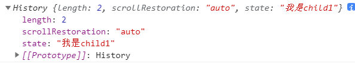

# Vue

## 二、生命周期

### 1. 说一下Vue的生命周期

Vue 实例有⼀个完整的⽣命周期，也就是从开始创建、初始化数据、编译模版、挂载Dom -> 渲染、更新 -> 渲染、卸载 等⼀系列过程，称这是Vue的⽣命周期。


- init Events & Lifecycle：初始化：生命周期、事件，但数据代理还未开始
- **beforeCreate**：数据监测和初始化事件还未开始，无法通过vm访问到data中的数据、methods的方法
- init injections & reactivity：初始化：数据监测、数据代理
- **created**：实例创建完成，包括data、computed、watch、methods等都配置完成
- 创建后挂载前：Vue开始解析模板，生成虚拟DOM（内存中），**页面还不能显示解析好的内容**

- **beforeMount**：页面呈现的是**未经Vue编译**的DOM结构，所有对DOM的操作，都不生效
- Create vm.$el and replace ‘el’ with it：将内存中的虚拟DOM转为真实DOM插入页面
- **mounted**：页面呈现的是**经过Vue编译**的DOM，对DOM的操作均有效。至此初始化过程结束，一般在此进行：开启定时器、发送网络请求、订阅消息、绑定自定义事件等**初始化操作**

- **beforeUpdate**：**数据是最新的，但页面是旧的**，即页面与数据尚未同步
- 虚拟DOM重新渲染：根据新数据，生成新的虚拟DOM，随后与旧的虚拟DOM进行比较，最终完成页面更新，即完成了Model —> View的更新
- **Updated**：**数据是新的，页面也是新的**，即页面与数据同步
- **beforeDestroy**：vm中所有的：data、methods、指令等，都处于可用状态，马上要执行销毁过程，一般在此阶段：关闭定时器、取消订阅消息、解绑自定义事件等**收尾操作**。

- teardown watchers, child components and event listeners
- **destroyed**

另外还有`keep-alive`独有的生命周期，分别是`activated`和`deactivated`。用`keep-alive`包裹的组件在切换时不会进行销毁，而是缓存到内存中执行`deactivated`钩子函数，命中缓存渲染后执行`activated`钩子函数。

### 2. Vue 子组件和父组件执行顺序

#### **加载渲染过程：**

- 父组件 beforeCreate
- 父组件 created
- 父组件 beforeMount
- 子组件 beforeCreate
- 子组件 created
- 子组件 beforeMount
- 子组件 mounted
- 父组件 mounted

#### **更新过程：**

- 父组件 beforeUpdate
- 子组件 beforeUpdate
- 子组件 updated
- 父组件 updated

#### 销毁过程：

- 父组件 beforeDestroy
- 子组件 beforeDestroy
- 子组件 destroyed
- 父组件 destroyed

### 3. created和mounted的区别

- created：在渲染模板成html前调用，即通常初始化某些属性值，然后再渲染成视图
- mounted：再模板渲染成html后调用，通常是初始化页面完成后，在对html的DOM节点进行操作

### 4. 一般在哪个生命周期请求异步数据

我们可以在created、beforeMount、mounted中进行调用，因为这三个钩子函数中，data已经创建，可以将从服务端返回数据进行赋值

推荐在created钩子函数中调用异步请求，因为在created钩子函数中调用异步请求有以下优点：

- 能更快获取到服务端数据，减少页面加载时间，用户体验更好
- SSR不支持beforeMount、mounted钩子，放在created中有助于一致性

### 5. keep-alive 中的生命周期哪些

如果一个keep-alive包裹了一个组件，那么它会多出两个生命周期：activated、deactivated。同时，beforeDestroy和destroyed就不会再被触发，因为组件不会被真正销毁。

当组件被换掉时，会被缓存到内存中，触发deactivated钩子，当组件切换回来时，再去缓存里找这个组件、触发activated钩子。

## 三、组件通信

### （1） props  /  $emit

父组件通过`props`向子组件传递数据，子组件通过`$emit`和父组件通信

#### 1. 父组件向子组件传值

- props只能父组件向子组件进行传值，props使得父子组件之间形成了一个单向下行绑定。子组件的数据会随着父组件不断更新。
- props可以定义一个或一个以上的数据，对于接收的数据，可以是各种数据类型，同样也可以传递一个函数。
- props属性名规则：若在props中使用驼峰形式，模板中需要使用短横线额形式

```js
// 父组件
<template>
    <div id="father">
        <son :msg="msgData" :fn="myFunction"></son>
    </div>
</template>

<script>
import son from "./son.vue";
export default {
    name: father,
    data() {
        msgData: "父组件数据";
    },
    methods: {
        myFunction() {
            console.log("vue");
        }
    },
    components: {
        son
    }
};
</script>
```

```js
// 子组件
<template>
    <div id="son">
        <p>{{msg}}</p>
        <button @click="fn">按钮</button>
    </div>
</template>
<script>
export default {
    name: "son",
    props: ["msg", "fn"]
};
</script>
```

#### 2. 子组件向父组件传值

- `$emit`绑定一个自定义事件，当这个事件被执行的时就会将参数传递给父组件，而父组件通过`v-on`监听并接收参数。
- 如果子组件想修改属性，则需要对一个prop进行`双向绑定`，用`update:myPropName`代替。

```js
this.$emit('update:title', newTitle)
```

注意带有 `.sync` 修饰符的 `v-bind` **不能**和表达式一起使用 (例如 `v-bind:title.sync=”doc.title + ‘!’”` 是无效的)。取而代之的是，你只能提供你想要绑定的 property 名，类似 `v-model`。

```js
<text-document
  v-bind:title="doc.title"
  v-on:update:title="doc.title = $event"
></text-document>
```

```js
// 父组件
<template>
  <div class="section">
    <com-article :articles.sync="articleList" @onEmitIndex="onEmitIndex"></com-article>
    <p>{{currentIndex}}</p>
  </div>
</template>

<script>
import comArticle from './test/article.vue'
export default {
  name: 'comArticle',
  components: { comArticle },
  data() {
    return {
      currentIndex: -1,
      articleList: ['红楼梦', '西游记', '三国演义']
    }
  },
  methods: {
    onEmitIndex(idx) {
      this.currentIndex = idx
    }
  }
}
</script>
```

```js
//子组件
<template>
  <div>
    <div v-for="(item, index) in articles" :key="index" @click="emitIndex(index)">{{item}}</div>
  </div>
</template>

<script>
export default {
  props: ['articles'],
  methods: {
    emitIndex(index) {
      this.$emit('onEmitIndex', index) // 触发父组件的方法，并传递参数index
      this.$emit('update:articles', '["水浒传"]')
    }
  }
}
</script>
```

### （2）eventBus事件总线（`$emit / $on`）

`eventBus`事件总线适用于**父子组件**、**非父子组件**等之间的通信，使用步骤如下：

#### **（1）创建事件中心管理组件之间的通信**

```js
// event-bus.js

import Vue from 'vue'
export const EventBus = new Vue()
```

#### **（2）发送事件** 假设有两个兄弟组件`firstCom`和`secondCom`：

```js
<template>
  <div>
    <first-com></first-com>
    <second-com></second-com>
  </div>
</template>

<script>
import firstCom from './firstCom.vue'
import secondCom from './secondCom.vue'
export default {
  name: 'App',
  components: { firstCom, secondCom }
}
</script>
```

##### 在`firstCom`组件中发送事件：

```js
<template>
  <div>
    <button @click="add">加法</button>    
  </div>
</template>

<script>
import {EventBus} from './event-bus.js' // 引入事件中心

export default {
  name: 'FirstCom',
  data(){
    return{
      num:0
    }
  },
  methods:{
    add(){
      EventBus.$emit('addition', {
        num:this.num++
      })
    }
  }
}
</script>
```

#### **（3）接收事件** 在`secondCom`组件中发送事件：

```js
<template>
  <div>求和: {{count}}</div>
</template>

<script>
import { EventBus } from './event-bus.js'
export default {
  data() {
    return {
      count: 0
    }
  },
  mounted() {
    EventBus.$on('addition', param => {
      this.count = this.count + param.num;
    })
  }
}
</script>
```

在上述代码中，这就相当于将`num`值存贮在了事件总线中，在其他组件中可以直接访问。事件总线就相当于一个桥梁，不用组件通过它来通信。

### （3）依赖注入（provide / inject）

这种方式就是Vue中的**依赖注入**，该方法用于**父子组件之间的通信**。当然这里所说的父子不一定是真正的父子，也可以是祖孙组件，在层数很深的情况下，可以使用这种方法来进行传值。就不用一层一层的传递了。

`provide / inject`是Vue提供的两个钩子，和`data`、`methods`是同级的。并且`provide`的书写形式和`data`一样。

- `provide` 钩子用来发送数据或方法
- `inject`钩子用来接收数据或方法

在父组件中：

```js
provide() { 
    return {     
        num: this.num  
    };
}
```

在子组件中：

```js
inject: ['num']
```

还可以这样写，这样写就可以访问父组件中的所有属性：

```js
provide() {
 return {
    app: this
  };
}
data() {
 return {
    num: 1
  };
}

inject: ['app']
console.log(this.app.num)
```

**提示**：`provide` 和 `inject` 绑定并不是可响应的。这是刻意为之的。然而，如果你传入了一个可监听的对象，那么其对象的 property 还是可响应的。

### （4）ref / $refs

这种方式也是实现**父子组件**之间的通信。

`ref`： 这个属性用在子组件上，它的引用就指向了子组件的实例。可以通过实例来访问组件的数据和方法。

在子组件中：

```js
export default {
  data () {
    return {
      name: 'JavaScript'
    }
  },
  methods: {
    sayHello () {
      console.log('hello')
    }
  }

```

在父组件中：

```js
<template>
  <child ref="child"></component-a>
</template>
<script>
  import child from './child.vue'
  export default {
    components: { child },
    mounted () {
      console.log(this.$refs.child.name);  // JavaScript
      this.$refs.child.sayHello();  // hello
    }
  }
</script>
```

### （5）`$parent / $children`

- 使用`$parent`可以让组件访问父组件的实例（访问的是上一级父组件的属性和方法）
- 使用`$children`可以让组件访问子组件的实例，但是，`$children`并不能保证顺序，并且访问的数据也不是响应式的。

在子组件中：

```js
<template>
  <div>
    <span>{{message}}</span>
    <p>获取父组件的值为:  {{parentVal}}</p>
  </div>
</template>

<script>
export default {
  data() {
    return {
      message: 'Vue'
    }
  },
  computed:{
    parentVal(){
      return this.$parent.msg;
    }
  }
}
</script>
```

在父组件中：

```js
// 父组件中
<template>
  <div class="hello_world">
    <div>{{msg}}</div>
    <child></child>
    <button @click="change">点击改变子组件值</button>
  </div>
</template>

<script>
import child from './child.vue'
export default {
  components: { child },
  data() {
    return {
      msg: 'Welcome'
    }
  },
  methods: {
    change() {
      // 获取到子组件
      this.$children[0].message = 'JavaScript'
    }
  }
}
</script>
```

在上面的代码中，子组件获取到了父组件的`parentVal`值，父组件改变了子组件中`message`的值。 **需要注意：**

- 通过`$parent`访问到的是上一级父组件的实例，可以使用`$root`来访问根组件的实例
- 在组件中使用`$children`拿到的是所有的子组件的实例，它是一个数组，并且是无序的
- 在根组件`#app`上拿`$parent`得到的是`new Vue()`的实例，在这实例上再拿`$parent`得到的是`undefined`，而在最底层的子组件拿`$children`是个空数组
- `$children` 的值是**数组**，而`$parent`是个**对象**

### （6）`$attrs / $listeners`

考虑一种场景，如果A是B组件的父组件，B是C组件的父组件。如果想要组件A给组件C传递数据，这种隔代的数据，该使用哪种方式呢？

如果是用`props/$emit`来一级一级的传递，确实可以完成，但是比较复杂；如果使用事件总线，在多人开发或者项目较大的时候，维护起来很麻烦；如果使用Vuex，的确也可以，但是如果仅仅是传递数据，那可能就有点浪费了。

针对上述情况，Vue引入了`$attrs / $listeners`，实现组件之间的跨代通信。

先来看一下`inheritAttrs`，它的默认值true，继承所有的父组件属性除`props`之外的所有属性；`inheritAttrs：false` 只继承class属性 。

- `$attrs`：继承所有的父组件属性（除了prop传递的属性、class 和 style ），一般用在子组件的子元素上
- `$listeners`：该属性是一个对象，里面包含了作用在这个组件上的所有监听器，可以配合 `v-on="$listeners"` 将所有的事件监听器指向这个组件的某个特定的子元素。（相当于子组件继承父组件的事件）

A组件（`APP.vue`）：

```js
<template>
    <div id="app">
        //此处监听了两个事件，可以在B组件或者C组件中直接触发 
        <child1 :p-child1="child1" :p-child2="child2" @test1="onTest1" @test2="onTest2"></child1>
    </div>
</template>
<script>
import Child1 from './Child1.vue';
export default {
    components: { Child1 },
    methods: {
        onTest1() {
            console.log('test1 running');
        },
        onTest2() {
            console.log('test2 running');
        }
    }
};
</script>
```

B组件（`Child1.vue`）：

```js
<template>
    <div class="child-1">
        <p>props: {{pChild1}}</p>
        <p>$attrs: {{$attrs}}</p>
        <child2 v-bind="$attrs" v-on="$listeners"></child2>
    </div>
</template>
<script>
import Child2 from './Child2.vue';
export default {
    props: ['pChild1'],
    components: { Child2 },
    inheritAttrs: false,
    mounted() {
        this.$emit('test1'); // 触发APP.vue中的test1方法
    }
};
</script>
```

C 组件 (`Child2.vue`)：

```js
<template>
    <div class="child-2">
        <p>props: {{pChild2}}</p>
        <p>$attrs: {{$attrs}}</p>
    </div>
</template>
<script>
export default {
    props: ['pChild2'],
    inheritAttrs: false,
    mounted() {
        this.$emit('test2');// 触发APP.vue中的test2方法
    }
};
</script>
```

### （7）总结

#### **（1）父子组件间通信**

- 子组件通过 props 属性来接受父组件的数据，然后父组件在子组件上注册监听事件，子组件通过 emit 触发事件来向父组件发送数据。
- 通过 ref 属性给子组件设置一个名字。父组件通过 `$refs` 组件名来获得子组件，子组件通过 `$parent` 获得父组件，这样也可以实现通信。
- 使用 provide/inject，在父组件中通过 provide提供变量，在子组件中通过 inject 来将变量注入到组件中。不论子组件有多深，只要调用了 inject 那么就可以注入 provide中的数据。

#### **（2）兄弟组件间通信**

- 使用 eventBus 的方法，它的本质是通过创建一个空的 Vue 实例来作为消息传递的对象，通信的组件引入这个实例，通信的组件通过在这个实例上监听和触发事件，来实现消息的传递。
- 通过 `$parent/$refs` 来获取到兄弟组件，也可以进行通信。

#### **（3）任意组件之间**

- 使用 eventBus ，其实就是创建一个事件中心，相当于中转站，可以用它来传递事件和接收事件。

## 四、路由

### 1. Vue-Router 的懒加载如何实现

非懒加载：

```js
import List from '@/components/list.vue'
const router = new VueRouter({
  routes: [
    { path: '/list', component: List }
  ]
})
```

（1）方案一(常用)：使用箭头函数+import动态加载

```js
const List = () => import('@/components/list.vue')
const router = new VueRouter({
  routes: [
    { path: '/list', component: List }
  ]
})
```

（2）方案二：使用箭头函数+require动态加载

```js
const router = new Router({
  routes: [
   {
     path: '/list',
     component: resolve => require(['@/components/list'], resolve)
   }
  ]
})
```

（3）方案三：使用webpack的require.ensure技术，也可以实现按需加载。 这种情况下，多个路由指定相同的chunkName，会合并打包成一个js文件。

```js
// r就是resolve
const List = r => require.ensure([], () => r(require('@/components/list')), 'list');
// 路由也是正常的写法  这种是官方推荐的写的 按模块划分懒加载 
const router = new Router({
  routes: [
  {
    path: '/list',
    component: List,
    name: 'list'
  }
 ]
}))
```

### 2. 路由的hash和history模式的区别

Vue-Router有两种模式：**hash模式**和**history模式**。默认的路由模式是hash模式。

#### 1. hash模式

**简介：** hash模式是开发中默认的模式，它的URL带着一个#，例如：[www.abc.com/#/vue](https://link.juejin.cn/?target=http%3A%2F%2Fwww.abc.com%2F%23%2Fvue)，它的hash值就是`#/vue`。

**特点**：hash值会出现在URL里面，但是不会出现在HTTP请求中，对后端完全没有影响。所以改变hash值，不会重新加载页面。这种模式的浏览器支持度很好，低版本的IE浏览器也支持这种模式。hash路由被称为是前端路由，已经成为SPA（单页面应用）的标配。

**原理：** hash模式的主要原理就是**onhashchange()事件**：

```js
window.onhashchange = function(event){
	console.log(event.oldURL, event.newURL);
	let hash = location.hash.slice(1);
}
```

使用onhashchange()事件的好处就是，在页面的hash值发生变化时，无需向后端发起请求，window就可以监听事件的改变，并按规则加载相应的代码。除此之外，hash值变化对应的URL都会被浏览器记录下来，这样浏览器就能实现页面的前进和后退。虽然是没有请求后端服务器，但是页面的hash值和对应的URL关联起来了。

#### 2. history模式

**简介：** history模式的URL中没有#，它使用的是传统的路由分发模式，即用户在输入一个URL时，服务器会接收这个请求，并解析这个URL，然后做出相应的逻辑处理。 

**特点：** 当使用history模式时，URL就像这样：[abc.com/user/id](https://link.juejin.cn?target=http%3A%2F%2Fabc.com%2Fuser%2Fid)。相比hash模式更加好看。但是，history模式需要后台配置支持。如果后台没有正确配置，访问时会返回404。

 **API：** history api可以分为两大部分，切换历史状态和修改历史状态：

- **修改历史状态**：包括了 HTML5 History Interface 中新增的 `pushState()` 和 `replaceState()` 方法，这两个方法应用于浏览器的历史记录栈，提供了对历史记录进行修改的功能。只是当他们进行修改时，虽然修改了url，但浏览器不会立即向后端发送请求。如果要做到改变url但又不刷新页面的效果，就需要前端用上这两个API。

- **切换历史状态：** 包括`forward()`、`back()`、`go()`三个方法，对应浏览器的前进，后退，跳转操作。

 **pushState()**

- 创建一个新的历史记录

  - 向当前浏览器会话的历史堆栈中添加一个状态（state）

  - state：640k个字符的大小限制

  - ```js
   history.pushState(state, title[, url])
   ```

- ```js
   history.pushState(this.child1,null,'hello-world.html')
  ```



**replaceState()**

- 修改当前历史记录实体，如果你想更新当前的state对象或者当前历史实体的URL来响应用户的的动作的话这个方法将会非常有用。

```js
history.replaceState(stateObj, title[, url]);
```

```js
 history.replaceState(this.child1, null, 'hello-world2.html')
```

这会让URL栏显示 `hello-world2.html`, 但是不会加载 `hello-world2.html` 页面，甚至不会检查hello-world2.html 是否存在

#### 3. 两种模式对比

调用 history.pushState() 相比于直接修改 hash，存在以下优势:

- pushState() 设置的新 URL 可以是与当前 URL 同源的任意 URL；而 hash 只可修改 # 后面的部分，因此只能设置与当前 URL 同文档的 URL；
- pushState() 设置的新 URL 可以与当前 URL 一模一样，这样也会把记录添加到栈中；而 hash 设置的新值必须与原来不一样才会触发动作将记录添加到栈中；
- pushState() 通过 stateObject 参数可以添加任意类型的数据到记录中；而 hash 只可添加短字符串；
- pushState() 可额外设置 title 属性供后续使用。
- hash模式下，仅hash符号之前的url会被包含在请求中，后端如果没有做到对路由的全覆盖，也不会返回404错误；history模式下，前端的url必须和实际向后端发起请求的url一致，如果没有对用的路由处理，将返回404错误。

### 3. 如何获取页面的hash变化

#### **（1）监听$route的变化**

```js
// 监听,当路由发生变化的时候执行
watch: {
  $route: {
    handler: function(val, oldVal){
      console.log(val);
    },
    // 深度观察监听
    deep: true
  }
},
```

#### **（2）window.location.hash读取#值**

 window.location.hash 的值可读可写，读取来判断状态是否改变，写入时可以在不重载网页的前提下，添加一条历史访问记录。

### 4. `$route 和$router` 的区别

- $route 是“路由信息对象”，包括 path，params，hash，query，fullPath，matched，name 等路由信息参数
- $router 是“路由实例”对象包括了路由的跳转方法，钩子函数等。

### 5. 如何定义动态路由？如何获取传过来的动态参数？

#### **（1）param方式**

- 配置路由格式：`/router/:id`
- 传递的方式：在path后面跟上对应的值
- 传递后形成的路径：`/router/123`

##### 1）路由定义

```js
//在APP.vue中
<router-link :to="'/user/'+userId" replace>用户</router-link>    

//在index.js
{
   path: '/user/:userid',
   component: User,
}
```

##### 2）路由跳转

```js
// 方法1：
<router-link :to="{ name: 'users', params: { uname: wade }}">按钮</router-link

// 方法2：
this.$router.push({name:'users',params:{uname:wade}})

// 方法3：
this.$router.push('/user/' + wade)
```

##### 3）参数获取 

通过 `$route.params` 获取传递的值

#### **（2）query方式**

- 配置路由格式：`/router`，也就是普通配置
- 传递的方式：对象中使用query的key作为传递方式
- 传递后形成的路径：`/route?id=123`

##### 1）路由定义

```js
//方式1：直接在router-link 标签上以对象的形式
<router-link :to="{path:'/profile',query:{name:'why',age:28,height:188}}">档案</router-link>

// 方式2：写成按钮以点击事件形式
<button @click='profileClick'>我的</button>    

profileClick(){
  this.$router.push({
    path: "/profile",
    query: {
        name: "kobi",
        age: "28",
        height: 198
    }
  });
}

```

##### 2）跳转方法

```js
// 方法1：
<router-link :to="{ name: 'users', query: { uname: james }}">按钮</router-link>

// 方法2：
this.$router.push({ name: 'users', query:{ uname:james }})

// 方法3：
<router-link :to="{ path: '/user', query: { uname:james }}">按钮</router-link>

// 方法4：
this.$router.push({ path: '/user', query:{ uname:james }})

// 方法5：
this.$router.push('/user?uname=' + jsmes)
```

##### 3）获取参数

通过$route.query 获取传递的值

### 6. Vue-router 路由钩子在生命周期的体现

#### 全局路由守卫

- 前置路由 beforeEach
  - beforeEach(to, from, next)：跳转前触发，常用于登录验证等需要跳转前告知的情况。
  - **`to: Route`**: 即将要进入的目标路由对象
  - **`from: Route`**: 当前导航正要离开的路由
  - **`next: Function`**: 一定要调用该方法来 **resolve** 这个钩子。
- 解析路由 beforeResolve
  - 在 beforeRouteEnter 调用之后调用
- 后置路由 afterEach
  - 进入路由之后

具体使用∶

- beforeEach（判断是否登录了，没登录就跳转到登录页）

```js
router.beforeEach((to, from, next) => {  
    let ifInfo = Vue.prototype.$common.getSession('userData');  // 判断是否登录的存储信息
    if (!ifInfo) { 
        // sessionStorage里没有储存user信息    
        if (to.path == '/') { 
            //如果是登录页面路径，就直接next()      
            next();    
        } else { 
            //不然就跳转到登录      
            Message.warning("请重新登录！");     
            window.location.href = Vue.prototype.$loginUrl;    
        }  
    } else {    
        return next();  
    }
})
```

- afterEach （跳转之后滚动条回到顶部）

```js
router.afterEach((to, from) => {  
    // 跳转之后滚动条回到顶部  
    window.scrollTo(0,0);
});
```

#### 独享路由守卫

**beforeEnter** 如果不想全局配置守卫的话，可以为某些路由单独配置守卫，有三个参数∶ to、from、next

```js
export default [    
    {        
        path: '/',        
        name: 'login',        
        component: login,        
        beforeEnter: (to, from, next) => {          
            console.log('即将进入登录页面')          
            next()        
        }    
    }
]
```

#### 组件内路由守卫

**beforeRouteUpdate**、**beforeRouteEnter**、**beforeRouteLeave**

这三个钩子都有三个参数∶to、from、next

- beforeRouteEnter∶ 进入组件前触发
- beforeRouteUpdate∶ 当前地址改变并且改组件被复用时触发，举例来说，带有动态参数的路径foo/∶id，在 /foo/1 和 /foo/2 之间跳转的时候，由于会渲染同样的foa组件，这个钩子在这种情况下就会被调用
- beforeRouteLeave∶ 离开组件被调用

#### Vue路由钩子在生命周期函数的体现

##### 完整的路由导航解析流程（不包括其他生命周期）

- 触发进去其他路由
- 调用要离开路由守卫 beforeRouteLeave
- 调用前置路由 beforeEach
- 在重用的组件里调用 beforeRouteUpdate
- 调用独享路由 beforeEnter
- 解析异步路由组件
- 在将要进入的路由组件中调用 beforeRouteEnter
- 调用全局解析路由 beforeResolve
- 导航被确认
- 调用全局后置路由afterEach
- 触发DOM更新（mounted）
- 执行beforeRouteEnter中传给next的回调
- 触发钩子的完整顺序

##### 路由导航、keep-alive、和组件生命周期钩子结合起来的，触发顺序，

###### 假设是从a组件离开，第一次进入b组件∶

- beforeRouteLeave：路由组件的组件离开路由前钩子，可取消路由离开
- beforeEach：路由全局前置守卫，可用于登录验证、全局路由loading等
- beforeEnter：路由独享守卫
- beforeRouteEnter：路由组件的组件进入路由前钩子
- beforeResolve：路由全局解析守卫
- afterEach：路由全局后置钩子
- beforeCreate：组件生命周期，无法访问到vm中的data、methods
- created：组件生命周期，可以访问vm中data的数据、methods中的方法
- beforeMount：组件生命周期，未经编译的页面，DOM操作不生效
- deactivated：离开缓存组件a，或者触发a的beforeDestroy和destroyed，组件销毁
- mounted：组件生命周期，初始化结束，可以操作DOM
- activated：进入缓存组件，进入a的子组件
- 执行beforeRouteEnter回调函数next


##### 导航行为被触发到导航完成的整个过程

- 导航行为被触发，此时导航未被确认
- 在失活的组件里调用离开守卫beforeRouteLeave
- 调用全局前置守卫beforeEach
- 在重用的组件里掉哦那个beforeRouteUpdate
- 在路由配置里调用beforeEnter
- 解析异步路由组件
- 在被激活的组件里调用 beforeRouteEnter。

- 调用全局的 beforeResolve 守卫（2.5+），标示解析阶段完成。

- 导航被确认。
- 调用全局的 afterEach 钩子。
- 非重用组件，开始组件实例的生命周期：beforeCreate&created、beforeMount&mounted
- 触发 DOM 更新。
- 用创建好的实例调用 beforeRouteEnter守卫中传给 next 的回调函数。
- 导航完成。

### 7. Vue-router跳转和location.href有什么区别

- 使用 `location.href= /url `来跳转，简单方便，但是刷新了页面；
- 使用 `history.pushState( /url )` ，无刷新页面，静态跳转；

- 引进 router ，然后使用 `router.push( /url )` 来跳转，使用了 `diff` 算法，实现了按需加载，减少了 dom 的消耗。其实使用 router 跳转和使用 `history.pushState()` 没什么差别的，因为vue-router就是用了 `history.pushState()` ，尤其是在history模式下。

### 8. params和query的区别

**用法**：query要用path来引入，params要用name来引入，接收参数都是类似的，分别是 `this.$route.query.name` 和 `this.$route.params.name` 。

**url地址显示**：query更加类似于ajax中get传参，params类似于post

**注意**：query刷新不会丢失query里面的数据 params刷新会丢失 params里面的数据。

### 9. Vue-router 导航守卫有哪些

- 全局路由守卫
  - beforeEach
  - beforeResolve
  - afterEach
- 独享路由
  - beforeEnter
- 组件内路由
  - beforeRouteEnter
  - beforeRouteUpdate
  - beforeRouteLeave

### 10. 对前端路由的理解

早期的话，是使用a标签进行页面跳转，那么肯定会有页面刷新。

然后ajax出现了，可以在不刷新页面的情况下发请求，然后就出现了SPA

但是SPA也有缺点：浏览器记不住操作，只要刷新页面，一切清零，由于只有一个url给页面做映射，对SEO不友好

为了解决这个问题，前端路由出现了

前端路由可以帮我们在仅有一个页面的情况下，记住用户当前走到了哪一步。

- 拦截用户的刷新操作，避免服务端盲目响应，返回不符合预期的资源内容。
- 感知URL变化。对url做处理，只要url变化，就会用js给它生成不同的内容

## 五、Vuex

### 1. Vuex 的原理

Vuex 是一个专为 Vue.js 应用程序开发的状态管理模式。每一个 Vuex 应用的核心就是 store（仓库）。“store” 基本上就是一个容器，它包含着你的应用中大部分的状态 ( state )。

- Vuex 的状态存储是响应式的。当 Vue 组件从 store 中读取状态的时候，若 store 中的状态发生变化，那么相应的组件也会相应地得到高效更新。
- 改变 store 中的状态的唯一途径就是显式地提交 (commit) mutation。这样可以方便地跟踪每一个状态的变化


#### **（1）核心流程中的主要功能：**

- Vue Components是vue组件，组件会触发一些事件或动作，也就是Actions
- 在组件中发出的动作，肯定是想获取或者改变数据，但是在vuex中，数据是集中管理的，不能直接更改数据，所以会把这个动作commit到Mutations中
- 然后Mutations就回去改变（Mutate）State的数据
- 当State中的数据被改变之后，就会重新渲染（Render）到Vue Coponents中去，组件站视更新后的数据，完成一个流程。

#### **（2）各模块在核心流程中的主要功能：**

- Vue components：Vue组件。Html页面上，负责接收用户操作等交互行为，执行dispatch方法触发对应action进行回应。
- dispatch：操作行为触发方法，是唯一能执行action的方法
- actions：操作行为处理模块。负责VC接收到的所有交互行为。包含同步/异步操作，支持多个同名方法，包括触发其它action以及提交mutation的操作。该模块提供了Promise的封装，以支持action的链式调用
- mutations：状态改变操作方法。是Vuex修改state的唯一推荐方法，其他修改方式在严格模式下会报错。该方法只能进行同步操作，且方法名只能全局唯一。操作之中会有一些hook暴露，以进行state的监控等。

- state：页面状态管理容器对象。集中存储VC中data对象的零散数据，全局唯一，以进行统一的状态管理。页面显示所需的数据从该对象中进行读取，利用Vue的细粒度数据响应机制来进行高效的状态更新。
- getters：state对象读取方法。图中没有单独列出该模块，应该被包含在render中，VC通过该方法读取全局state对象。

### 2. Vuex中action和mutation的区别

mutation中的操作是一系列的同步函数，用于修改state中的变量的状态。当使用vuex时需要通过commit来提交需要操作的内容。mutation非常类似于事件：每个mutation都有一个字符串的事件类型（type）和一个回调函数（handler）。这个回调函数就是实际进行状态修改的地方，并且它会接受state作为第一个参数：

```js
const store = new Vuex.Store({
  state: {
    count: 1
  },
  mutations: {
    increment (state) {
      state.count++      // 变更状态
    }
  }
})
```

当触发一个类型为 increment 的 mutation 时，需要调用此函数：

```js
store.commit('increment')
```

而Action类似于mutation，不同点在于：

- Action可以包含任意异步操作
- Action提交的mutation，而不是直接修改状态

Action函数接受一个与store实例具有相同方法和属性的context对象，因此可以调用context.commit提交一个mutation，或者通过context.sate和context.getters来获取state和getters。所以，两者的不同点如下：

- Mutation：专注于修改State，理论上是修改State的唯一途径：Action业务代码、异步请求。
- Mutation：必须同时执行；Action：可以异步，但是不能直接操作State
- 在视图更新时，先触发actions，actions再触发mutation
- mutation的参数是state，它包含store中的数据；action的参数是context，它是state的父级，包含state、getters

### 3. Vuex 和 localStorage 的区别

#### **（1）最重要的区别**

- vuex存储在内存中
- localStorage则以文件的方式存在本地，只能存储字符串类型的数据，存储对象需要JSON.stringify和parse方法进行处理

#### **（2）应用场景**

- Vuex，集中式存储管理应用的所有组件的状态，并以相应的规则保证状态以一种可预测的方式发生变化。vuex用于组件之间传值
- localStorage是本地存储，是将数据存储到浏览器的方法，一般是在跨页面传递数据时使用
- Vuex能做到数据的响应式，localStorage不能

#### **（3）永久性**

- 刷新页面时Vuex存储的值会丢失，localStorage不会

**注意：**对于不变的数据确实可以用localStorage代替Vuex，但是当两个组件共用一个数据源时，如果其中一个组件改变了该数据源，希望另一个组件响应该变化时，localStorage无法做到，原因就是区别1.

### 4. Redux 和 Vuex 有什么区别，它们的共同思想

#### **（1）Redux 和 Vuex区别**

- Vuex改进了Redux中的Action和Reducer函数，以mutations变化函数取代Reducer，无需switch，只需在对应的mutation函数里改变state值即可
- Vuex由于Vue自动重新渲染的特性，无需订阅重新渲染函数，只要生成新的State即可
- Vuex数据流的顺序是：View调用store.commit提交对应的请求到Store中对应的mutation函数—–>store改变（vue检测到数据变化自动渲染）

vuex 弱化 dispatch，通过commit进行 store状态的一次更变;取消了action概念，不必传入特定的 action形式进行指定变更;弱化reducer，基于commit参数直接对数据进行转变，使得框架更加简易

#### **（2）共同思想**

- 单一数据源
- 变化可以预测

本质上：redux和vuex都是对mvvm思想服务，将数据从视图中抽离的一种方案

形式上：vuex借鉴了redux，将sotre作为全局的数据中心，进行mode管理

### 5. 为什么要用 Vuex 或者 Redux

由于传参的方法对于多层嵌套的组件将会非常繁琐，并且对于兄弟组件间的状态传递无能为力。我们经常会采用父子组件直接引用或者通过事件来变更和同步状态的多份拷贝。以上的这些模式非常脆弱，通常会导致代码无法维护。

所以需要把组件的共享状态抽取出来，以一个全局单例模式管理。在这种模式下，组件树构成了一个巨大的"视图"，不管在树的哪个位置，任何组件都能获取状态或者触发行为。

另外，通过定义和隔离状态管理中的各种概念并强制遵守一定的规则，代码将会变得更结构化且易维护。

### 6. Vuex有哪几种属性？

有五种，分别是 State、 Getter、Mutation 、Action、 Module

- state => 基本数据(数据源存放地)
- getters => 从基本数据派生出来的数据
- mutations => 提交更改数据的方法，同步
- actions => 像一个装饰器，包裹mutations，使之可以异步。
- modules => 模块化Vuex

### 7. Vuex和单纯的全局对象有什么区别？

- Vuex 的状态存储是响应式的。当 Vue 组件从 store 中读取状态的时候，若 store 中的状态发生变化，那么相应的组件也会相应地得到高效更新。
- 不能直接改变store中的状态。唯一途径就是显式地提交（commit）mutation。这样可以方便地跟踪每一个状态的变化，从而能够实现一些工具帮助更好地了解我们的应用。

### 8. 为什么 Vuex 的 mutation 中不能做异步操作？

- Vuex中所有的状态更新的唯一途径都是mutation，异步操作通过 Action 来提交 mutation实现，这样可以方便地跟踪每一个状态的变化。
- 每个mutation执行完成后都会对应到一个新的状态变更，这样devtools就可以打个快照存下来，然后就可以实现 time-travel 了。如果mutation支持异步操作，就没有办法知道状态是何时更新的，无法很好的进行状态的追踪，给调试带来困难。

### 9. Vuex的严格模式是什么,有什么作用，如何开启？

在严格模式下，无论何时发生了状态变更且不是由mutation函数引起的，将会抛出错误。这能保证所有的状态变更都能被调试工具跟踪到。

在Vuex.Store 构造器选项中开启,如下

```js
const store = new Vuex.Store({
    strict:true,
})
```

### 10. 如何在组件中批量使用Vuex的getter属性

使用mapGetters辅助函数, 利用对象展开运算符将getter混入computed 对象中

```js
import {mapGetters} from 'vuex'
export default{
    computed:{
        ...mapGetters(['total','discountTotal'])
    }
}
```

### 11. 如何在组件中重复使用Vuex的mutation

使用mapMutations辅助函数,在组件中这么使用

```js
import { mapMutations } from 'vuex'
methods:{
    ...mapMutations({
        setNumber:'SET_NUMBER',
    })
}
```

然后调用`this.setNumber(10)`相当调用`this.$store.commit('SET_NUMBER',10)`

## 七、虚拟DOM

### 1. 对虚拟DOM的理解？

从本质上来说，Virtual Dom是一个JavaScript对象，通过对象的方式来表示DOM结构。将页面的状态抽象为JS对象的形式，配合不同的渲染工具，使跨平台渲染成为可能。通过事务处理机制，将多次DOM修改的结果一次性的更新到页面上，从而有效的减少页面渲染的次数，减少修改DOM的重绘重排次数，提高渲染性能。

虚拟DOM是对DOM的抽象，这个对象是更加轻量级的对DOM的描述。它设计的最初目的，就是更好的跨平台，比如Node.js就没有DOM，如果想实现SSR，那么一个方式就是借助虚拟DOM，因为虚拟DOM本身是js对象。在代码渲染到页面之前，vue会把代码转换为一个对象（虚拟DOM）。以对象的形式来描述真实DOM结构，最终渲染到页面。在每次数据发生变化前，虚拟DOM都会缓存一份，变化之时，现在的虚拟DOM会与缓存的虚拟DOM进行比较。在vue内部封装了diff算法，通过这个算法来进行比较，渲染时修改改变的变化，原先没有发生改变的通过原先的数据进行渲染。


### 2. 虚拟DOM的解析过程

虚拟DOM的解析过程：

- 首先对将插入到文档中的DOM树结构进行分析，使用js对象将其表示出来，比如一个元素对象，包含TagName、props和Children这些属性。然后将这个js对象树给保存下来，最后将DOM片段插入到文档中。
- 当页面的状态发生改变，需要对页面的DOM结构进行调整时，首先根据变更的状态，重新构建起一棵对象树，然后将这棵新的对象树和旧的对象树进行比较，记录下两棵树的差异。
- 最后将记录的有差异的地方应用到真正的DOM树中去，这样视图就更新了。

### 3. 为什么要用虚拟DOM

#### **（1）保证性能下限**

在不进行手动优化的情况下，提供过得去的性能看一下页面渲染的流程：**解析HTML -> 生成DOM -> 生成 CSSOM -> Layout -> Paint -> Compiler** 下面对比一下修改DOM时真实DOM操作和Virtual DOM的过程，来看一下它们重排重绘的性能消耗∶

- 真实DOM∶ 生成HTML字符串＋重建所有的DOM元素
- 虚拟DOM∶ 生成vNode+ DOMDiff＋必要的dom更新

Virtual DOM的更新DOM的准备工作耗费更多的时间，也就是JS层面，相比于更多的DOM操作它的消费是极其便宜的。尤雨溪在社区论坛中说道∶ 框架给你的保证是，你不需要手动优化的情况下，依然可以给你提供过得去的性能。

#### **（2）跨平台**

 Virtual DOM本质上是JavaScript的对象，它可以很方便的跨平台操作，比如服务端渲染、uniapp等。

### 4. 虚拟DOM真的比真实DOM性能好吗

- 首次渲染大量DOM时，由于多了一层虚拟DOM的计算，会比innerHTML插入慢。
- 正如它能保证性能下限，在真实DOM操作的适合进行针对性的优化时，还是更快的。

### 5. DIFF算法的原理

在新旧虚拟DOM对比时：

- 首先，对比节点本身，判断是否为同一节点，如果不为相同节点，则删除该节点重新创建节点进行替换
- 如果为相同节点，进行patchVnode，判断如何对该节点的子节点进行处理，先判断一方有子节点，一方没有子节点的情况（如果新的children没有子节点，将旧的子节点移除）
- 比较如果都有子节点，则进行updateChildren，判断如何对这些新旧节点的子节点进行操作（diff核心）

- 匹配时，找到相同的子节点，递归比较子节点。

在diff中，只对同层的子节点进行比较，放弃跨级的节点比较，使得时间复杂从O(n3)降低值O(n)，也就是说，只有当新旧children都为多个子节点时才需要用核心的Diff算法进行同层级比较。

### 6、patch函数

1. 在这一系列的函数里面，有很多的钩子函数，类似于 destory 和 create 、insert 的 钩子函数，事实上 这些 钩子函数 用户使用的时候是无知觉的，因为 这个是虚拟 dom 的组件的 钩子函数，类似于 style 组件，事件 on 组件，这些 钩子函数
2. 在 patch 函数里，调用了 核心函数 ***patchVnode*** 函数，也正是 这个函数，调用了 ***diff ：updateChildren 函数***
3. 主要函数判断了老节点是否存在，然后执行销毁或者创建，然后执行 ***patchVnode***

```js
// 用于比较新旧节点的不同，然后更新的函数
return function patch (oldVnode, vnode, hydrating, removeOnly) {
    // 当新节点不存在的时候，销毁旧节点
    if (isUndef(vnode)) {
        if (isDef(oldVnode)) invokeDestroyHook(oldVnode)
        return
    }

    let isInitialPatch = false
    // 用来储存 insert 钩子函数，在插入节点后调用
    const insertedVnodeQueue = []
    // 如果旧节点是未定义的，直接创建新节点
    if (isUndef(oldVnode)) {
        // empty mount (likely as component), create new root element
        isInitialPatch = true
        createElm(vnode, insertedVnodeQueue)
    } else {
        const isRealElement = isDef(oldVnode.nodeType)
        // 如果旧节点不是真实的DOM节点，当两个节点是相同节点时，进入patchVnode函数
        // 而 patchVnode 也是传说中 diff updateChildren的调用者
        if (!isRealElement && sameVnode(oldVnode, vnode)) {
            // patch existing root node
            patchVnode(oldVnode, vnode, insertedVnodeQueue, null, null, removeOnly)
        } else {
            // 当旧节点时真实存在的DOM节点时
            if (isRealElement) {
                // 当旧节点时真实DOM，并且是在SSR环境下，修改SSR_ATTR属性
                if (oldVnode.nodeType === 1 && oldVnode.hasAttribute(SSR_ATTR)) {
                    oldVnode.removeAttribute(SSR_ATTR)
                    hydrating = true
                }
                if (isTrue(hydrating)) {
                    if (hydrate(oldVnode, vnode, insertedVnodeQueue)) {
                        invokeInsertHook(vnode, insertedVnodeQueue, true)
                        return oldVnode
                    } else if (process.env.NODE_ENV !== 'production') {
                        warn(
                            'The client-side rendered virtual DOM tree is not matching ' +
                            'server-rendered content. This is likely caused by incorrect ' +
                            'HTML markup, for example nesting block-level elements inside ' +
                            '<p>, or missing <tbody>. Bailing hydration and performing ' +
                            'full client-side render.'
                        )
                    }
                }
                // either not server-rendered, or hydration failed.
                // create an empty node and replace it
                // 设置 oldVnode 为一个包含 oldVnode的无属性节点
                oldVnode = emptyNodeAt(oldVnode)
            }

            // replacing existing element
            const oldElm = oldVnode.elm 
            // 获取父节点，这样方便删除或者增加节点
            const parentElm = nodeOps.parentNode(oldElm)

            // create new node
            // 在dom中插入新节点
            createElm(
                vnode,
                insertedVnodeQueue,
                // extremely rare edge case: do not insert if old element is in a
                // leaving transition. Only happens when combining transition +
                // keep-alive + HOCs. (#4590)
                oldElm._leaveCb ? null : parentElm,
                nodeOps.nextSibling(oldElm)
            )
            // 递归更新父占位符元素
            // 就是执行一遍父节点的destroy和create、insert的钩子函数
            if (isDef(vnode.parent)) {
                let ancestor = vnode.parent
                const patchable = isPatchable(vnode)
                while (ancestor) {
                    for (let i = 0; i < cbs.destroy.length; ++i) {
                        cbs.destroy[i](ancestor)
                    }
                    ancestor.elm = vnode.elm
                    if (patchable) {
                        for (let i = 0; i < cbs.create.length; ++i) {
                            cbs.create[i](emptyNode, ancestor)
                        }
                        // #6513
                        // invoke insert hooks that may have been merged by create hooks.
                        // e.g. for directives that uses the "inserted" hook.
                        const insert = ancestor.data.hook.insert
                        if (insert.merged) {
                            // start at index 1 to avoid re-invoking component mounted hook
                            for (let i = 1; i < insert.fns.length; i++) {
                                insert.fns[i]()
                            }
                        }
                    } else {
                        registerRef(ancestor)
                    }
                    ancestor = ancestor.parent
                }
            }

            // 销毁旧节点
            if (isDef(parentElm)) {
                removeVnodes([oldVnode], 0, 0)
            } else if (isDef(oldVnode.tag)) {
                // 触发旧节点的destroy钩子
                invokeDestroyHook(oldVnode)
            }
        }
    }
    // 执行虚拟dom的insert钩子
    invokeInsertHook(vnode, insertedVnodeQueue, isInitialPatch)
    // 返回最新的vnode的elm，也就是真实的dom节点
    return vnode.elm
}
```

### 7、patchVnode 函数

patchVnode 函数是对比 两个虚拟 dom 不同的地方， 同时 也是 递归 调用 updateChildren 的 函数

1. 首先看是否是同一个节点、是否是 注释节点、是否是 异步函数组件、是否是静态节点，是否是 once 的节点，是的话，不执行
2. 是否存在子节点，然后新老节点的子节点是否相同，否就执行 updateChildren 函数深入对比
3. 否则就查看新老节点是否存在，新节点存在但是老节点不存在，增加，新节点不存在但是老节点存在，删除
4. 检查 新老节点的 text 属性是否一致，否的话，就更新

```js
// 对比 两个虚拟 dom 不同的地方，同时 也是 递归 调用 updateChildren 的 函数
  function patchVnode (
    oldVnode, // 旧节点
    vnode,  // 新节点
    insertedVnodeQueue, // 插入节点的队列
    ownerArray, // 节点 数组
    index,  // 当前节点的索引
    removeOnly // 只有在patch函数中被传入，当旧节点不是真实DOM节点，当新旧节点是相同节点的时候
  ) {
    // 如果新旧节点相等
    // 直接返回，就是当props没有改变时，子组件不会渲染，而是直接复用
    if (oldVnode === vnode) {
      return
    }

    if (isDef(vnode.elm) && isDef(ownerArray)) {
      // clone reused vnode
      vnode = ownerArray[index] = cloneVNode(vnode)
    }

    const elm = vnode.elm = oldVnode.elm
    // 当 当前节点 是 注释节点（被 v-if）了，或者是个 异步函数节点，那就不执行
    if (isTrue(oldVnode.isAsyncPlaceholder)) {
      if (isDef(vnode.asyncFactory.resolved)) {
        hydrate(oldVnode.elm, vnode, insertedVnodeQueue)
      } else {
        vnode.isAsyncPlaceholder = true
      }
      return
    }

    // 当前节点是一个静态节点的时候，或者标记了 once 的时候，那不执行
    if (isTrue(vnode.isStatic) &&
      isTrue(oldVnode.isStatic) &&
      vnode.key === oldVnode.key &&
      (isTrue(vnode.isCloned) || isTrue(vnode.isOnce))
    ) {
      vnode.componentInstance = oldVnode.componentInstance
      return
    }

    let i
    const data = vnode.data
    // 调用 prepatch 钩子
    if (isDef(data) && isDef(i = data.hook) && isDef(i = i.prepatch)) {
      i(oldVnode, vnode)
    }

    const oldCh = oldVnode.children
    const ch = vnode.children
    // 调用 update 钩子
    if (isDef(data) && isPatchable(vnode)) {
      // 这里的 update 钩子 是 vnode 本身的钩子
      for (i = 0; i < cbs.update.length; ++i) cbs.update[i](oldVnode, vnode)
      // 这里的 update 钩子 是 用户传过来的钩子
      if (isDef(i = data.hook) && isDef(i = i.update)) i(oldVnode, vnode)
    }
    // 判断新节点有无 text 属性
    if (isUndef(vnode.text)) {
      // 如果都有子节点，对比更新子节点
      if (isDef(oldCh) && isDef(ch)) {
        if (oldCh !== ch) updateChildren(elm, oldCh, ch, insertedVnodeQueue, removeOnly)
      } else if (isDef(ch)) { // 新节点存在，但是旧节点不存在
        if (process.env.NODE_ENV !== 'production') {
          checkDuplicateKeys(ch)
        }
        // 如果旧节点是 text  清空
        if (isDef(oldVnode.text)) nodeOps.setTextContent(elm, '')
        // 增加子节点
        addVnodes(elm, null, ch, 0, ch.length - 1, insertedVnodeQueue)
      } else if (isDef(oldCh)) { // 旧节点存在，但是新节点不存在，执行删除
        removeVnodes(oldCh, 0, oldCh.length - 1)
      } else if (isDef(oldVnode.text)) { // 如果是旧节点的 text， 清空
        nodeOps.setTextContent(elm, '')
      }
      // 新旧节点 text 属性不一样
    } else if (oldVnode.text !== vnode.text) {
      // 将 text 设置为 新节点的 text
      nodeOps.setTextContent(elm, vnode.text)
    }
    if (isDef(data)) {
      // 执行 postpatch 钩子
      if (isDef(i = data.hook) && isDef(i = i.postpatch)) i(oldVnode, vnode)
    }
  }
```

### 8、createElm

将 vnode 转换为 真实的 dom 节点

1. 判断当前的 vnode tag 标签是否是存在的
2. 如果存在，创建对应的节点，然后 设置 样式的 作用域 
3. 遍历子元素，并插入节点之中
4. 触发 create 钩子函数
5. 如果tag 标签不存在，判断是否是 注释节点，然后创建
6. 如果tag 标签不存在，且不是 注释节点，直接创建文本节点


