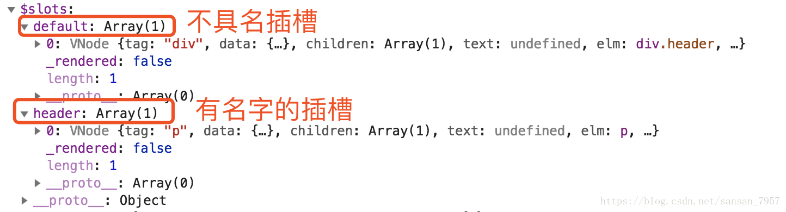

# 一、Vue 基础

### 1. Vue的基本原理

当一个Vue实例创建时，Vue会遍历data中的属性，用 Object.defineProperty（vue3.0使用proxy ）将它们转为 getter/setter，并且在内部追踪相关依赖，在属性被访问和修改时通知变化。 每个组件实例都有相应的 watcher 程序实例，它会在组件渲染的过程中把属性记录为依赖，之后当依赖项的setter被调用时，会通知watcher重新计算，从而致使它关联的组件得以更新。


### 2. 双向数据绑定的原理

Vue.js 是采用**数据劫持**结合**发布者-订阅者模式**的方式，通过Object.defineProperty()来劫持各个属性的setter，getter，在数据变动时发布消息给订阅者，触发相应的监听回调。主要分为以下几个步骤：

- 需要observe的数据对象进行递归遍历，包括子属性对象的属性，都加上setter和getter这样的话，给这个对象的某个值赋值，就会触发setter，那么就能监听到了数据变化

- compile解析模板指令，将模板中的变量替换成数据，然后初始化渲染页面视图，并将每个指令对应的节点绑定更新函数，添加监听数据的订阅者，一旦数据有变动，收到通知，更新视图

- Watcher订阅者是Observer和Compile之间通信的桥梁，主要做的事情是: ①在自身实例化时往属性订阅器(dep)里面添加自己 ②自身必须有一个update()方法 ③待属性变动dep.notice()通知时，能调用自身的update()方法，并触发Compile中绑定的回调，则功成身退。

  

### 3. 使用 Object.defineProperty() 来进行数据劫持有什么缺点？

在对一些属性进行操作时，使用这种方法无法拦截，比如通过下标方式修改数组数据或者给对象新增属性，都不能触发组件的重新渲染，Object.definedProperty拦截不到。其实对于数组而言，大部分操作都拦截不到，只是Vue内部通过重写函数的方式解决了。

在Vue3.0中已经不再使用这个方式了，用Proxy对对象进行代理，从而实现数据劫持。

### 4. MVVM、MVC、MVP的区别

**（1）MVC**

MVC 通过分离 Model、View 和 Controller 的方式来组织代码结构。其中 View 负责页面的显示逻辑，Model 负责存储页面的业务数据，以及对相应数据的操作。并且 View 和 Model 应用了观察者模式，当 Model 层发生改变的时候它会通知有关 View 层更新页面。Controller 层是 View 层和 Model 层的纽带，它主要负责用户与应用的响应操作，当用户与页面产生交互的时候，Controller 中的事件触发器就开始工作了，通过调用 Model 层，来完成对 Model 的修改，然后 Model 层再去通知 View层更新。


**（2）MVVM**

MVVM 分为 Model、View、ViewModel：

- Model代表数据模型，数据和业务逻辑都在Model层中定义；
- View代表UI视图，负责数据的展示；
- ViewModel负责监听Model中数据的改变并且控制视图的更新，处理用户交互操作；

Model和View并无直接关联，而是通过ViewModel来进行联系的，Model和ViewModel之间有着双向数据绑定的联系。因此当Model中的数据改变时会触发View层的刷新，View中由于用户交互操作而改变的数据也会在Model中同步。


### 5. Computed 、Watch和Methods 的区别

#### 对于Computed：

- 支持缓存，只有依赖的数据发生了变化，才会重新计算
- 不支持异步，当Computed中有异步操作时，无法监听数据的变化
- computed的值会默认走缓存，计算属性是基于它们的响应式依赖进行缓存的，也就是基于data声明过，或者父组件传递过来的props中的数据进行计算的。
- 如果一个属性是由其他属性计算而来的，这个属性依赖其他的属性，一般会使用computed
- 如果computed属性的属性值是函数，那么默认使用get方法，函数的返回值就是属性的属性值，在computed中，属性有一个get方法和set方法，当数据发生变化时，会调用set方法。

#### 对于Watch：

- 不支持缓存，数据变化时，就会触发相应的操作
- 支持异步监听
- 监听的函数（handler）接受两个参数，第一个是最新的值（newValue），第二个是变化之前的值（oldValue）
- 监听数据必须时data中声明的或者是props中的数据，当发生变化时，会触发其他操作
  - immediate：组件加载立即触发回调
  - deep：深度监听，发现数据内部的变化，在复杂数据类型中使用，例如数组中的对象变化。需要注意的是，deep无法监听到数组和对象内部的变化。

#### 对于Methods：

- 可以将一个函数定义为method，method调用总会执行该函数

##### 总结：

- computed计算属性：依赖其他属性值，并且computed的值有缓存，只有它依赖的属性值发生改变，下一次获取computed的值时才会重新计算computed的值。
- watch监听器：更多的是**观察**的作用，无缓存性，类似于某些数据的监听回调，每当监听的数据变化时，都会执行回调进行后续操作。

##### 运用场景：

- 当需要数值计算，并且依赖于其他数据时，应该使用computed，因为可以利用computed的缓存特性，避免每次获取值时都要重新计算。
- 当需要在数据变化时执行异步或开销较大的操作时，应该使用watch，使用watch选项允许执行异步操作，限制执行该操作的频率，并在得到结果前，设置中间状态。这些都是计算属性无法做到的。

### 7. slot是什么？有什么作用？原理是什么？

slot又名插槽，是Vue的内容分发机制，组件内部的模板引擎使用slot元素作为承载分发内容的出口，显示内容由父组件决定。

- 默认插槽：又名匿名插槽，当slot没有指定name属性值的时候，就是默认插槽，一个组件内只能有一个默认插槽。
- 具名插槽：带name属性的slot，一个组件可以有很多个具名插槽
- 作用于插槽：默认插槽、具名插槽的一个变种，可以是匿名，也可以是具名，不同点是子组件渲染作用域插槽时，可以将子组件内部的数据传给父组件，让父组件根据子组件传递的数据决定如何渲染该插槽。

实现原理：当子组件vm实例化时，获取父组件传入的slot标签内容，存在放`vm.$slot`中，默认插槽为`vm.$slot.default`，具名插槽为`vm.$slot.xxx`，xxx为插槽名，当组件执行渲染函数时候，遇到slot标签，使用`$slot`中的内容进行替换，此时可以为插槽传递数据，若存在数据，则可称为该插槽为作用域插槽。

### 8. 过滤器的作用，如何实现一个过滤器

根据过滤器的名称，过滤器是用来过滤数据的，在Vue中使用`filters`来过滤数据，`filters`不会修改数据，而是过滤数据，改变用户看到的输出（计算属性 `computed` ，方法 `methods` 都是通过修改数据来处理数据格式的输出显示）。

**使用场景：**

- 需要格式化数据的情况，比如需要处理时间、价格等数据格式的输出 / 显示。
- 比如后端返回一个 **年月日的日期字符串**，前端需要展示为 **多少天前** 的数据格式，此时就可以用`fliters`过滤器来处理数据。

过滤器是一个函数，它会把表达式中的值始终当作函数中的第一个参数，过滤器用在插值表达式和v-bind表达式中，然后放在操作符`|`后面进行指示。

```js
<li>商品价格：{{item.price | filterPrice}}</li>

 filters: {
    filterPrice (price) {
      return price ? ('￥' + price) : '--'
    }
  }
```

### 9. 如何保存页面的当前的状态

如何保持组件的状态，两种情况：

- 前组件会被卸载
- 前组件不会被卸载

#### 组件会被卸载：

##### **（1）将状态存储在LocalStorage / SessionStorage**

在组件`beforeDestory`的生命周期中，在LocalStorage/SessionStorage中把当前组件的state通过JSON.stringifyy()存储下来就可以了。在这里需要注意组件更新状态的时机。

 比如从B组件跳转到A组件，A组件需要更新自身状态，但是从别的组件跳转到B组件时，实际上时希望B组件重新渲染的，不从Storage中读取信息。所以需要在Storage中的状态加入一个flag属性，用来控制A组件是否读取Storage中的状态。

**优点：**

- 兼容性好，不需要额外库或工具。
- 简单快捷，基本可以满足大部分需求。

**缺点：**

- 状态通过 JSON 方法储存（相当于深拷贝），如果状态中有特殊情况（比如 Date 对象、Regexp 对象等）的时候会得到字符串而不是原来的值。
- 如果 B 组件后退或者下一页跳转并不是前组件，那么 flag 判断会失效，导致从其他页面进入 A 组件页面时 A 组件会重新读取 Storage，会造成很奇怪的现象。

##### **（2）路由传值**

```js
<router-link :to="{
name: 'detail',
    params:{
        id: m.id,
            title: m.title
    }
}">


{
    name: 'detail',
    path: 'detail/:id/:title', //使用占位符声明params参数
    component: Detail,
    //props的第一种写法，值为对象，该对象中的所有key value都会以props形式传给Detail组件
    // props: {a:1,b:'hello'}

    //props的第二种写法，值为布尔值，若布尔值为真，就会把该路由组件收到的所有params参数，以props形式传给Detail组件
        // props: true
        //props的第三种写法，值为函数
        props ($route){
        return {
            id: $route.params.id, 
            title: $route.params.title
        }
    }
}
```

**优点：**

- 简单快捷，不会污染 LocalStorage / SessionStorage。
- 可以传递 Date、RegExp 等特殊对象（不用担心 JSON.stringify / parse 的不足）

**缺点：**

- 如果 A 组件可以跳转至多个组件，那么在每一个跳转组件内都要写相同的逻辑。

#### **组件不会被卸载：**

##### **（1）单页面渲染**

要切换的组件作为子组件全屏渲染，父组件中正常储存页面状态。

**优点：**

- 代码量少
- 不需要考虑状态传递过程中的错误

**缺点：**

- 增加 A 组件维护成本
- 需要传入额外的 prop 到 B 组件
- 无法利用路由定位页面

除此之外，在Vue中，还可以是用**keep-alive**来缓存页面，当组件在keep-alive内被切换时组件的**activated、deactivated**这两个生命周期钩子函数会被执行 被包裹在keep-alive中的组件的状态将会被保留：

```js
<keep-alive>
	<router-view v-if="$route.meta.keepAlive"></router-view>
</kepp-alive>

 <!-- 缓存一个路由组件 -->
<keep-alive include="News">
  <router-view></router-view>
</keep-alive>

 <!-- 缓存多个路由组件 -->
<keep-alive :include="['News', 'Message']">
   <router-view></router-view>
</keep-alive>
```

**router.js**

```js
{
  path: '/',
  name: 'xxx',
  component: ()=>import('../src/views/xxx.vue'),
  meta:{
    keepAlive: true // 需要被缓存
  }
},
```

### 10. 常见的事件修饰符及其作用

- `.stop`：等同于 JavaScript 中的 `event.stopPropagation()` ，防止事件冒泡
  - 事件冒泡：当一个元素接收到事件的时候 会把他接收到的事件传给自己的父级，一直到window。

- `.prevent`：等同于Javascript中的`event.preventDeafult()`，阻止默认事件
- `.capture`：与事件冒泡的方向相反，事件捕获由外到内
- `.self`：只会触发自己范围内的事件，不包含子元素
- `.once`：只会触发一次

### 11. v-if、v-show、v-html 的原理

- v-if会调用`addIfCondition`方法，生成vnode的时候会忽略对应节点，render的时候就不会渲染
- v-show会生成vnode，render的时候也会渲染成真实节点，只是在render过程中会在节点的属性中修改show属性值，也就是display
- v-html会先移除节点下的所有节点，调用html方法，通过addProp添加innerHTML属性，归根结底还是设置inner HTML为v-html的值

### 13. v-if和v-show的区别

- **手段**：v-if是动态的向DOM树内添加或者删除DOM元素；v-show是通过设置DOM元素的display样式属性控制显隐；
- **编译过程**：v-if切换有一个局部编译/卸载的过程，切换过程中合适地销毁和重建内部的事件监听和子组件；v-show只是简单的基于css切换；
- **编译条件**：v-if是惰性的，如果初始条件为假，则什么也不做；只有在条件第一次变为真时才开始局部编译; v-show是在任何条件下，无论首次条件是否为真，都被编译，然后被缓存，而且DOM元素保留；
- **性能消耗**：v-if有更高的切换消耗，v–show有着更高的初始渲染消耗
- **适用场景**：v-if适合运营条件不大可能改变，v-show适合频繁切换

### 14. v-model 是如何实现的，语法糖实际是什么？

**（1）作用在表单元素上** 动态绑定了 input 的 value 指向了 messgae 变量，并且在触发 input 事件的时候去动态把 message设置为目标值：

```js
<input v-model="sth" />
//  等同于
<input 
    v-bind:value="message" 
    v-on:input="message=$event.target.value"
>
//$event 指代当前触发的事件对象;
//$event.target 指代当前触发的事件对象的dom;
//$event.target.value 就是当前dom的value值;
//在@input方法中，value => sth;
//在:value中,sth => value;
```

**（2）作用在组件上** 在自定义组件中，v-model 默认会利用名为 value 的 prop和名为 input 的事件

**本质是一个父子组件通信的语法糖，通过prop和$.emit实现。**因此父组件v-model语法糖本质上可以修改为

```js
<child 
	:value="message"  
	@input="function(e){message = e}"
></child>
```

在组件的实现中，可以通过 v-model属性来配置子组件接收的prop名称，以及派发的事件名称。 例子：

```js
// 父组件
<aa-input v-model="aa"></aa-input>
// 等价于
<aa-input v-bind:value="aa" v-on:input="aa=$event.target.value"></aa-input>

// 子组件：
<input v-bind:value="aa" v-on:input="onmessage"></aa-input>

props:{value:aa,}
methods:{
    onmessage(e){
        $emit('input',e.target.value)
    }
}
```

### 16. data为什么是一个函数而不是对象

JavaScript中的对象是引用类型的数据，当多个实例引用同一个对象时，只要一个实例对这个对象进行操作，其他实例中的数据也会发生变化。

而在Vue中，更多的是想要复用组件，那就需要每个组件都有自己的数据，这样组件之间才不会相互干扰。

所以组件的数据不能写成对象的形式，而是要写成函数的形式。数据以函数返回值的形式定义，这样当每次复用组件的时候，就会返回一个新的data，也就是说每个组件都有自己的私有数据空间，它们各自维护自己的数据，不会干扰其他组件的正常运行。

### 17. 对keep-alive的理解，它是如何实现的，具体缓存的是什么？

如果需要在组件切换的时候，保存一些组件的状态防止多次渲染，就可以使用 keep-alive 组件包裹需要保存的组件。

#### **（1）keep-alive**

keep-alive有以下三个属性：

- include 字符串或正则表达式，只有名称匹配的组件会被匹配；
- exclude 字符串或正则表达式，任何名称匹配的组件都不会被缓存；
- max 数字，最多可以缓存多少组件实例。

**注意：keep-alive 包裹动态组件时，会缓存不活动的组件实例。**

**主要流程**

- 判断组件 name ，不在 include 或者在 exclude 中，直接返回 vnode，说明该组件不被缓存。
- 获取组件实例 key ，如果有获取实例的 key，否则重新生成。
- key生成规则，cid +"∶∶"+ tag ，仅靠cid是不够的，因为相同的构造函数可以注册为不同的本地组件。
- 如果缓存对象内存在，则直接从缓存对象中获取组件实例给 vnode ，不存在则添加到缓存对象中。 5.最大缓存数量，当缓存组件数量超过 max 值时，清除 keys 数组内第一个组件。

#### **（2）keep-alive 的实现**

```js
const patternTypes: Array<Function> = [String, RegExp, Array] // 接收：字符串，正则，数组

export default {
  name: 'keep-alive',
  abstract: true, // 抽象组件，是一个抽象组件：它自身不会渲染一个 DOM 元素，也不会出现在父组件链中。

  props: {
    include: patternTypes, // 匹配的组件，缓存
    exclude: patternTypes, // 不去匹配的组件，不缓存
    max: [String, Number], // 缓存组件的最大实例数量, 由于缓存的是组件实例（vnode），数量过多的时候，会占用过多的内存，可以用max指定上限
  },

  created() {
    // 用于初始化缓存虚拟DOM数组和vnode的key
    this.cache = Object.create(null)
    this.keys = []
  },

  destroyed() {
    // 销毁缓存cache的组件实例
    for (const key in this.cache) {
      pruneCacheEntry(this.cache, key, this.keys)
    }
  },

  mounted() {
    // prune 削减精简[v.]
    // 去监控include和exclude的改变，根据最新的include和exclude的内容，来实时削减缓存的组件的内容
    this.$watch('include', (val) => {
      pruneCache(this, (name) => matches(val, name))
    })
    this.$watch('exclude', (val) => {
      pruneCache(this, (name) => !matches(val, name))
    })
  },
}
```

#### （3）keep-alive也使用了LRU缓存策略

- 获取 keep-alive 下第一个子组件的实例对象，通过他去获取这个组件的组件名
- 通过当前组件名去匹配原来 include 和 exclude，判断当前组件是否需要缓存，不需要缓存，直接返回当前组件的实例vNode
- 需要缓存，判断他当前是否在缓存数组里面：
- 存在，则将他原来位置上的 key 给移除，同时将这个组件的 key 放到数组最后面（LRU）
- 不存在，将组件 key 放入数组，然后判断当前 key数组是否超过 max 所设置的范围，超过，那么削减未使用时间最长的一个组件的 key
- 最后将这个组件的 keepAlive 设置为 true

#### （4）LRU缓存策略

RU 缓存策略∶ 从内存中找出最久未使用的数据并置换新的数据。根据数据的历史访问记录来进行淘汰数据，其核心思想是 **"如果数据最近被访问过，那么将来被访问的几率也更高"**。

- 新数据插入到链表头部
- 每当缓存命中（即缓存数据被访问），则将数据移到链表头部
- 链表满的时候，将链表尾部的数据丢弃。

### 15. render函数

#### render函数作用

**render**和**templeate**一样都是创建html模板的，但是有些场景中用`template`实现起来代码冗长复杂且大量重复，这时候就可用`render函数`。

官网例子：子组件想要根据父组件传递的`level`值（1-6）来决定渲染标签`h几`。

#### render函数讲解

`render函数`即渲染函数，它是个函数，它的参数也是个函数----即**`createElement`**

- render函数的返回值（VNode）
  - VNode：虚拟节点，也就是我们要渲染的节点
- render函数的参数（createElement）
  - `createElement`是`render函数`的参数，它本身也是个函数，并且有三个参数

#### createElement 函数的返回值（VNode）

#### createElement 函数的参数（三个）

- 一个HTML标签字符串，组件选项对象，或者解析上述任何一种的一个async异步函数。类型：`{ String | Object | Function }`。**必需**

- 一个包含模板相关属性的数据对象，你可以在template中使用这些特性。类型：{ Object }。可选。
- 子虚拟节点（VNodes），由`createElement()`构建而成，也可以用字符串来生成”文本虚拟节点”。类型： { String | Array }。 可选

```js
 /**
  * render: 渲染函数
  * 参数: createElement
  * 参数类型: Function
 */
 render: function (createElement) {
   let _this = this['$options'].parent	// 我这个是在 .vue 文件的 components 中写的，这样写才能访问this
   let _header = _this.$slots.header   	// $slots: vue中所有分发插槽，不具名的都在default里
 
   /**
    * createElement 本身也是一个函数，它有三个参数
    * 返回值: VNode，即虚拟节点
    * 1. 一个 HTML 标签字符串，组件选项对象，或者解析上述任何一种的一个 async 异步函数。必需参数。{String | Object | Function} - 就是你要渲染的最外层标签
    * 2. 一个包含模板相关属性的数据对象你可以在 template 中使用这些特性。可选参数。{Object} - 1中的标签的属性
    * 3. 子虚拟节点 (VNodes)，由 `createElement()` 构建而成，也可以使用字符串来生成“文本虚拟节点”。可选参数。{String | Array} - 1的子节点，可以用 createElement() 创建，文本节点直接写就可以
    */
   return createElement(       
     // 1. 要渲染的标签名称：第一个参数【必需】      
     'div',   
     // 2. 1中渲染的标签的属性，详情查看文档：第二个参数【可选】
     {
       style: {
         color: '#333',
         border: '1px solid #ccc'
       }
     },
     // 3. 1中渲染的标签的子元素数组：第三个参数【可选】
     [
       'text',   // 文本节点直接写就可以
       _this.$slots.default,  // 所有不具名插槽，是个数组
       createElement('div', _header)   // createElement()创建的VNodes
     ]
   )
 }
```

可以看下控制台中打印出来的 `$slots`




⚠️ 从 2.6.0 开始，官方文档推荐使用作用域插槽访问所有 `$slots`

### 18. $nextTick 原理及作用

**Vue 的 nextTick 其本质是对 JavaScript 执行原理 EventLoop 的一种应用。**

nextTick 的核心是利用了如 Promise 、MutationObserver、setImmediate、setTimeout的原生 JavaScript 方法来模拟对应的微/宏任务的实现，本质是为了**利用 JavaScript 的这些异步回调任务队列来实现 Vue 框架中自己的异步回调队列**。

nextTick 是典型的将底层 JavaScript 执行原理应用到具体案例中的示例，引入异步更新队列机制的原因∶

- 如果是同步更新，则多次对一个或多个属性赋值，会频繁触发 UI/DOM 的渲染，可以减少一些无用渲染
- 同时由于 VirtualDOM 的引入，每一次状态发生变化后，状态变化的信号会发送给组件，组件内部使用 VirtualDOM 进行计算得出需要更新的具体的 DOM 节点，然后对 DOM 进行更新操作，每次更新状态后的渲染过程需要更多的计算，而这种无用功也将浪费更多的性能，所以异步渲染变得更加至关重要

Vue采用了数据驱动视图的思想，但是在一些情况下，仍然需要操作DOM。有时候，可能遇到这样的情况，DOM1的数据发生了变化，而DOM2需要从DOM1中获取数据，那这时就会发现DOM2的视图并没有更新，这时就需要用到了`nextTick`了。

由于Vue的DOM操作是异步的，所以，在上面的情况中，就要将DOM2获取数据的操作写在`$nextTick`中。

所以，在以下情况下，会用到nextTick：

- 在数据变化后执行的某个操作，而这个操作需要使用随数据变化而变化的DOM结构的时候，这个操作就需要方法在`nextTick()`的回调函数中。
- 在vue生命周期中，如果在created()钩子进行DOM操作，也一定要放在`nextTick()`的回调函数中。

因为在created()钩子函数中，页面的DOM还未渲染，这时候也没办法操作DOM，所以，此时如果想要操作DOM，必须将操作的代码放在`nextTick()`的回调函数中。

### **19. Vue 中给 data 中的对象属性添加一个新的属性时会发生什么？如何解决？**

点击 button 会发现，obj.b 已经成功添加，但是视图并未刷新。这是因为在Vue实例创建时，obj.b并未声明，因此就没有被Vue转换为响应式的属性，自然就不会触发视图的更新，这时就需要使用Vue的全局 api **$set()：**

```js
addObjB () (
   this.$set(this.obj, 'b', 'obj.b')
   console.log(this.obj)
}
```

### 20. Vue中封装的数组方法有哪些，其如何实现页面更新

在Vue中，对响应式处理利用的是Object.defineProperty对数据进行拦截，而这个方法并不能监听到数组内部变化，数组长度变化，数组的截取变化等，所以需要对这些操作进行hack，让Vue能监听到其中的变化。


```js
// 缓存数组原型
const arrayProto = Array.prototype;
// 实现 arrayMethods.__proto__ === Array.prototype
export const arrayMethods = Object.create(arrayProto);
// 需要进行功能拓展的方法
const methodsToPatch = [
  "push",
  "pop",
  "shift",
  "unshift",
  "splice",
  "sort",
  "reverse"
];

/**
 * Intercept mutating methods and emit events
 */
methodsToPatch.forEach(function(method) {
  // 缓存原生数组方法
  const original = arrayProto[method];
  def(arrayMethods, method, function mutator(...args) {
    // 执行并缓存原生数组功能
    const result = original.apply(this, args);
    // 响应式处理
    const ob = this.__ob__;
    let inserted;
    switch (method) {
    // push、unshift会新增索引，所以要手动observer
      case "push":
      case "unshift":
        inserted = args;
        break;
      // splice方法，如果传入了第三个参数，也会有索引加入，也要手动observer。
      case "splice":
        inserted = args.slice(2);
        break;
    }
    // 
    if (inserted) ob.observeArray(inserted);// 获取插入的值，并设置响应式监听
    // notify change
    ob.dep.notify();// 通知依赖更新
    // 返回原生数组方法的执行结果
    return result;
  });
});
```

简单来说就是：重写了数组中的那些原生方法，首先获取到这个数组的`__ob__`，也就是它的`Observer`对象，如果有新的值，就调用`observeArray`继续对新的值观察变化（也就是进行了原型链重写，通过原型链指向了自己定义的数组原型方法），然后手动调用`notify()`，通知渲染watcher，执行update

### 21. Vue 单页应用与多页应用的区别

- SPA单页面应用，指只有一个主页面的应用，一开始只需要加载一次js、css等相关资源。所有内容都包含在主页面，对每一个功能模块组件化。单页应用跳转，就是切换相关组件，仅仅刷新局部资源。
- MPA多页面应用，指有多个独立页面的应用，每个页面必须重复记载js、css等相关资源。多页应用跳转，需要整页资源刷新。


### 22. Vue template 到 render 的过程

vue的模版编译过程主要如下：**template -> ast -> render函数**

vue 在模版编译版本的码中会执行 compileToFunctions 将template转化为render函数：

```js
// 将模板编译为render函数
const { render, staticRenderFns } = compileToFunctions(template,options//省略}, this)
```

CompileToFunctions中的主要逻辑如下∶ 

#### **（1）调用parse方法将template转化为ast（抽象语法树）**

```js
constast = parse(template.trim(), options)
```

- **parse的目标**：把template转换为AST树，它是一种用Javascript对象的形式来描述整个模板
- **解析过程**：利用正则表达式顺序解析模板，当解析到开始标签、闭合标签、文本的适合都会分别执行对应的回调函数，来达到构造AST树的目的。

**AST元素节点总共三种类型：type为1表示普通元素、2为表达式、3为纯文本**

#### **（2）对静态节点做优化**

```js
optimize(ast,options)
```

- 这个过程主要分析出哪些是静态节点，给其打一个标记，为后续更新渲染可以直接跳过静态节点做优化。

- 深度遍历AST，查看每个子树的节点元素是否为静态节点或者静态节点根。如果为静态节点，他们生成的DOM永远不会改变，这对运行时模板更新起到了极大的优化作用。

#### **（3）生成代码**

```js
const code = generate(ast, options)
```

generate将ast抽象语法树编译成 render字符串并将静态部分放到` staticRenderFns` 数组中，最后通过 `new Function( render)` 生成render函数。

### 23. Vue data 中某一个属性的值发生改变后，视图会立即同步执行重新渲染吗？

不会立即同步执行重新渲染。Vue实现响应式并不是数据发生变化之后DOM立即变化，而是按一定的策略进行DOM更新。Vue在更新DOM时是异步执行的。只要监听到数据变化，Vue将开启一个队列，并缓冲在同一事件循环中发生的所有数据变更。

如果同一个watcher被多次触发，只会被推入到队列中一次。这种在缓冲时去除重复数据对于避免不必要的计算和 DOM 操作是非常重要的。然后，在下一个的事件循环tick中，Vue 刷新队列并执行实际（已去重的）工作。

### 24. 简述 mixins、extends 的覆盖逻辑

#### （1）**mixins** 和 **extends**均是用于合并、拓展组件的，两者均通过 mergeOptions 方法实现合并。

- mixins接受一个混入对象的数组，其中混入对象可以像正常的实例对象一样包含实力选项，这些选项会被合并到最终的选项中。mixin钩子按照传入顺序依次调用，并在调用组件自身的钩子之前触发

```js
var mixin = {
  created: function () { console.log(1) }
}
var vm = new Vue({
  created: function () { console.log(2) },
  mixins: [mixin]
})
// => 1
// => 2
```

- extends 主要是为了便于扩展单文件组件，接收一个对象或构造函数。

```js
var CompA = { ... }

// 在没有调用 `Vue.extend` 时候继承 CompA
var CompB = {
  extends: CompA,
  ...
}
```

#### **（2）mergeOptions 的执行过程**

- 规范化选项（normalizeProps、normalizelnject、normalizeDirectives)
- 对未合并的选项，进行判断

```js
 if (!child._base) {
     if (child.extends) {
         parent = mergeOptions(parent, child.extends, vm);
     }
     if (child.mixins) {
         for (let i = 0, l = child.mixins.length; i < l; i++) {
             parent = mergeOptions(parent, child.mixins[i], vm);
         }
     }
 }
```

- 合并处理。根据一个通用 Vue 实例所包含的选项进行分类逐一判断合并，如 props、data、 methods、watch、computed、生命周期等，将合并结果存储在新定义的 options 对象里。
- 返回合并结果 options。

### 25. 描述下Vue自定义指令

在 Vue2.0 中，代码复用和抽象的主要形式是组件。然而，有的情况下，你仍然需要对普通 DOM 元素进行底层操作，这时候就会用到自定义指令。一般需要对DOM元素进行底层操作时使用，尽量只用来操作 DOM展示，不修改内部的值。当使用自定义指令直接修改 value 值时绑定v-model的值也不会同步更新；如必须修改可以在自定义指令中使用keydown事件，在vue组件中使用 change事件，回调中修改vue数据;

#### **（1）自定义指令基本内容**

- 全局定义：Vue.diirective(‘focus’, { })
- 局部定义：directives: { focus: { } }

- 钩子函数：指令定义对象提供钩子函数
  - bind：只调用一次，指令第一次绑定到元素时调用。在这里可以进行一次性的初始化设置
  - inSerted：被绑定元素插入父节点时调用（仅保证父节点存在，但不一定已被插入文档中）。
  -  update：所在组件的VNode更新时调用，但是可能发生在其子VNode更新之前调用。指令的值可能发生了改变，也可能没有。但是可以通过比较更新前后的值来忽略不必要的模板更新。
  - ComponentUpdate：指令所在组件的 VNode及其子VNode全部更新后调用。
  - unbind：只调用一次，指令与元素解绑时调用。

#### **（2）使用场景**

- 普通DOM元素进行底层操作的时候，可以使用自定义指令
- 自定义指令是用来操作DOM的。尽管Vue推崇数据驱动视图的理念，但并非所有情况都适合数据驱动。自定义指令就是一种有效的补充和扩展，不仅可用于定义任何的DOM操作，并且是可复用的。

#### **（3）使用案例**

初级应用：

- 鼠标聚焦
- 下拉菜单
- 相对时间转换
- 滚动动画

高级应用：

- 自定义指令实现图片懒加载
- 自定义指令集成第三方插件

### 26. 子组件可以直接改变父组件的数据吗？

子组件不可以直接改变父组件的数据。这样做主要是为了维护父子组件的单向数据流。每次父级组件发生更新时，子组件中所有的 prop 都将会刷新为最新的值。如果这样做了，Vue 会在浏览器的控制台中发出警告。

Vue提倡单向数据流，即父级 props 的更新会流向子组件，但是反过来则不行。这是为了防止意外的改变父组件状态，使得应用的数据流变得难以理解，导致数据流混乱。如果破坏了单向数据流，当应用复杂时，debug 的成本会非常高。

**只能通过 `$emit`派发一个自定义事件，父组件接收到后，由父组件修改。**

### 27. Vue是如何收集依赖的？


### 28. 对 React 和 Vue 的理解，它们的异同

#### **相似之处：**

- 都将注意力集中保持在核心库，而将其他功能如路由和全局状态管理交给相关的库；
- 都有自己的构建工具，能让你得到一个根据最佳实践设置的项目模板；
- 都使用了Virtual DOM（虚拟DOM）提高重绘性能；
- 都有props的概念，允许组件间的数据传递；
- 都鼓励组件化应用，将应用分拆成一个个功能明确的模块，提高复用性。

#### **不同之处 ：**

##### **1）数据流**

Vue默认支持数据双向绑定，而React一直提倡单向数据流

##### **2）虚拟DOM**

- Vue宣称可以更快地计算出Virtual DOM的差异，这是由于它在渲染过程中，会跟踪每一个组件的依赖关系，不需要重新渲染整个组件树。
- 对于React而言，每当应用的状态被改变时，全部子组件都会重新渲染。当然，这可以通过 PureComponent/shouldComponentUpdate这个生命周期方法来进行控制，但Vue将此视为默认的优化。

##### **3）组件化**

React与Vue最大的不同是模板的编写。

- Vue鼓励写近似常规HTML的模板。写起来很接近标准 HTML元素，只是多了一些属性。
- React推荐你所有的模板通用JavaScript的语法扩展——JSX书写。

##### **4）监听数据变化的实现原理不同**

- Vue 通过 getter/setter 以及一些函数的劫持，能精确知道数据变化，不需要特别的优化就能达到很好的性能
- React 默认是通过比较引用的方式进行的，如果不优化（PureComponent/shouldComponentUpdate）可能导致大量不必要的vDOM的重新渲染。这是因为 Vue 使用的是可变数据，而React更强调数据的不可变。

##### **5）高阶组件**

react可以通过高阶组件（HOC）来扩展，而Vue需要通过mixins来扩展。

高阶组件就是高阶函数，而React的组件本身就是纯粹的函数，所以高阶函数对React来说易如反掌。相反Vue.js使用HTML模板创建视图组件，这时模板无法有效的编译，因此Vue不能采用HOC来实现。

##### **6）构建工具**

- React ==> Create React APP
- Vue ==> vue-cli

##### **7）跨平台**

- React ==> React Native
- Vue ==> Weex

### 29. Vue的优点

- 轻量级框架：只关注视图层，是一个构建数据的视图集合，大小只有几十 `kb` 
- 简单易学：国人开发，中文文档，不存在语言障碍 ，易于理解和学习；
- 双向数据绑定：保留了 `angular` 的特点，在数据操作方面更为简单；
- 组件化：保留了 `react` 的优点，实现了 `html` 的封装和重用，在构建单页面应用方面有着独特的优势；
- 视图，数据，结构分离：使数据的更改更为简单，不需要进行逻辑代码的修改，只需要操作数据就能完成相关操作；
- 虚拟DOM：`dom` 操作是非常耗费性能的，不再使用原生的 `dom` 操作节点，极大解放 `dom` 操作，但具体操作的还是 `dom` 不过是换了另一种方式；
- 运行速度更快：相比较于 `react` 而言，同样是操作虚拟 `dom`，就性能而言， `vue` 存在很大的优势。

### 30. assets和static的区别

**相同点：** `assets` 和 `static` 两个都是存放静态资源文件。项目中所需要的资源文件图片，字体图标，样式文件等都可以放在这两个文件下，这是相同点

**不相同点：**`assets` 中存放的静态资源文件在项目打包时，也就是运行 `npm run build` 时会将 `assets` 中放置的静态资源文件进行打包上传，所谓打包简单点可以理解为压缩体积，代码格式化。`static` 中放置的静态资源文件就不会要走打包压缩格式化等流程，而是直接进入打包好的目录，直接上传至服务器。因为避免了压缩直接进行上传，在打包时会提高一定的效率，但是 `static` 中的资源文件由于没有进行压缩等操作，所以文件的体积也就相对于 `assets` 中打包后的文件提交较大点。在服务器中就会占据更大的空间。

**建议：** 将项目中 `template`需要的样式文件js文件等都可以放置在 `assets` 中，走打包这一流程。减少体积。而项目中引入的第三方的资源文件如`iconfoont.css` 等文件可以放置在 `static` 中，因为这些引入的第三方文件已经经过处理，不再需要处理，直接上传。

### 31. delete和Vue.delete删除数组的区别

- `delete` 只是被删除的元素变成了 `empty/undefined` 其他的元素的键值还是不变。
- `Vue.delete` 直接删除了数组 改变了数组的键值。

### 32. vue如何监听对象或者数组某个属性的变化

当在项目中直接设置数组的某一项的值，或者直接设置对象的某个属性值，这个时候，你会发现页面并没有更新。这是因为Object.defineProperty()限制，监听不到变化。

解决方式：

- this.$set(你要改变的数组/对象，你要改变的位置/key，你要改成什么value)

```js
this.$set(this.arr, 0, "OBKoro1"); // 改变数组
this.$set(this.obj, "c", "OBKoro1"); // 改变对象
```

- 调用以下几个数组的方法

```js
splice()、 push()、pop()、shift()、unshift()、sort()、reverse()
```

**vm.`$set` 的实现原理是：**

- 如果目标是数组，直接使用数组的 splice 方法触发响应式；
- 如果目标是对象，会先判读属性是否存在、对象是否是响应式，最终如果要对属性进行响应式处理，则是通过调用 defineReactive 方法进行响应式处理（defineReactive 方法就是 Vue 在初始化对象时，给对象属性采用 Object.defineProperty 动态添加 getter 和 setter 的功能所调用的方法）

### 33. 什么是 mixin ？

- Mixin 使我们能够为 Vue 组件编写可插拔和可重用的功能。
- 如果希望在多个组件之间重用一组组件选项，例如生命周期 hook、 方法等，则可以将其编写为 mixin，并在组件中简单的引用它。
- 然后将 mixin 的内容合并到组件中。如果你要在 mixin 中定义生命周期 hook，那么它在执行时将优化于组件自已的 hook。

#### mixins与vuex的区别

- vuex：用来做状态管理的，里面定义的变量在每个组件中均可以使用和修改，在任一组件中修改此变量的值之后，其他组件中此变量的值也会随之修改。
- Mixins：可以定义共用的变量，在每个组件中使用，引入组件中之后，各个变量是相互独立的，值的修改在组件中不会相互影响。

#### mixins与公共组件的区别

- 组件：在父组件中引入组件，相当于在父组件中给出一片独立的空间供子组件使用，然后根据props来传值，但本质上两者是相对独立的。
- Mixins：则是在引入组件之后与组件中的对象和方法进行合并，相当于扩展了父组件的对象与方法，可以理解为形成了一个新的组件。

### 34. Vue模版编译原理

vue中的模板template无法被浏览器解析并渲染，因为这不属于浏览器的标准，不是正确的HTML语法，所有需要将template转化成一个JavaScript函数，这样浏览器就可以执行这一个函数并渲染出对应的HTML元素，就可以让视图跑起来了，这一个转化的过程，就成为模板编译。模板编译又分三个阶段，解析parse，优化optimize，生成generate，最终生成可执行函数render。

- **解析阶段**：使用大量的正则表达式对template字符串进行解析，将标签、指令、属性等转化为抽象语法树AST。
- **优化阶段**：遍历AST，找到其中的一些静态节点并进行标记，方便在页面重渲染的时候进行diff比较时，直接跳过这一些静态节点，优化runtime的性能。
- **生成阶段**：将最终的AST转化为render函数字符串。

### 35. 对SSR的理解

SSR也就是服务端渲染，也就是将Vue在客户端把标签渲染成HTML的工作放在服务端完成，然后再把html直接返回给客户端

SSR的优势：

- 更好的SEO
- 首屏加载速度更快

SSR的缺点：

- 开发条件会受到限制，服务器端渲染只支持beforeCreate和created两个钩子；
- 当需要一些外部扩展库时需要特殊处理，服务端渲染应用程序也需要处于Node.js的运行环境；
- 更多的服务端负载。

### 36. Vue的性能优化有哪些

#### **（1）编码阶段**

- 尽量减少data中的数据，data中的数据都会增加getter和setter，会收集对应的watcher
- v-if和v-for不能连用
- 如果需要使用v-for给每项元素绑定事件时，使用事件代理
- SPA页面才用keep-alive缓存组件
- key保证唯一
- 使用路由懒加载、异步组件
- 防抖、节流
- 第三方模块按需引入
- 长列表滚动到可视区域动态加载
- 图片懒加载

#### **（2）SEO优化**

- 预渲染
- 服务端渲染SSR

#### **（3）打包优化**

- 压缩代码
- Tree Shaking/Scope Hoisting
- 使用cdn加载第三方模块
- 多线程打包happypack
- splitChunks抽离公共文件
- sourceMap优化

#### **（4）用户体验**

- 骨架屏
- PWA
- 还可以使用缓存（客户端缓存、服务端缓存）优化、服务端开启gzip压缩等

### 38. template和jsx的有什么分别？

对于 runtime 来说，只需要保证组件存在 render 函数即可，而有了预编译之后，只需要保证构建过程中生成 render 函数就可以。在 webpack 中，使用`vue-loader`编译.vue文件，内部依赖的`vue-template-compiler`模块，在 webpack 构建过程中，将template预编译成 render 函数。与 react 类似，在添加了jsx的语法糖解析器`babel-plugin-transform-vue-jsx`之后，就可以直接手写render函数。

所以，**template和jsx的都是render的一种表现形式**，不同的是：J**SX相对于template而言，具有更高的灵活性，在复杂的组件中，更具有优势，而 template 虽然显得有些呆滞**。**但是 template 在代码结构上更符合视图与逻辑分离的习惯，更简单、更直观、更好维护**。

### 39. vue初始化页面闪动问题

使用vue开发时，在vue初始化之前，由于div是不归vue管的，所以我们写的代码在还没有解析的情况下会容易出现花屏现象，看到类似于{{message}}的字样，虽然一般情况下这个时间很短暂，但是还是有必要让解决这个问题的。

### 40. extend 有什么作用

这个 API 很少用到，作用是扩展组件生成一个构造器，通常会与 `$mount` 一起使用。

```js
// 创建组件构造器
let Component = Vue.extend({  template: '<div>test</div>'})
// 挂载到 #app 上
new Component().$mount('#app')
// 除了上面的方式，还可以用来扩展已有的组件
let SuperComponent = Vue.extend(Component)
new SuperComponent({    
    created() {        
        console.log(1)    
    }
})
new SuperComponent().$mount('#app')

```

### 41. mixin 和 mixins 区别

`mixin` 用于全局混入，会影响到每个组件实例，通常插件都是这样做初始化的。

```js
Vue.mixin({    beforeCreate() {        // ...逻辑        
    // 这种方式会影响到每个组件的 beforeCreate 钩子函数    }})
```

虽然文档不建议在应用中直接使用 `mixin`，但是如果不滥用的话也是很有帮助的，比如可以全局混入封装好的 `ajax` 或者一些工具函数等等。

`mixins` 应该是最常使用的扩展组件的方式了。如果多个组件中有相同的业务逻辑，就可以将这些逻辑剥离出来，通过 `mixins` 混入代码，比如上拉下拉加载数据这种逻辑等等。 另外需要注意的是 `mixins` 混入的钩子函数会先于组件内的钩子函数执行，并且在遇到同名选项的时候也会有选择性的进行合并。

### 42. **MVVM**的优缺点?

优点:

- 分离视图（View）和模型（Model），降低代码耦合，提⾼视图或者逻辑的重⽤性: ⽐如视图（View）可以独⽴于Model变化和修改，⼀个ViewModel可以绑定不同的"View"上，当View变化的时候Model不可以不变，当Model变化的时候View也可以不变。你可以把⼀些视图逻辑放在⼀个ViewModel⾥⾯，让很多view重⽤这段视图逻辑
- 提⾼可测试性: ViewModel的存在可以帮助开发者更好地编写测试代码
- ⾃动更新dom: 利⽤双向绑定,数据更新后视图⾃动更新,让开发者从繁琐的⼿动dom中解放

缺点：

- Bug很难被调试: 因为使⽤双向绑定的模式，当你看到界⾯异常了，有可能是你View的代码有Bug，也可能是Model的代码有问题。数据绑定使得⼀个位置的Bug被快速传递到别的位置，要定位原始出问题的地⽅就变得不那么容易了。另外，数据绑定的声明是指令式地写在View的模版当中的，这些内容是没办法去打断点debug的
- ⼀个⼤的模块中model也会很⼤，虽然使⽤⽅便了也很容易保证了数据的⼀致性，当时⻓期持有，不释放内存就造成了花费更多的内存
- 对于⼤型的图形应⽤程序，视图状态较多，ViewModel的构建和维护的成本都会⽐较⾼。


