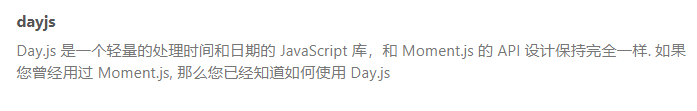
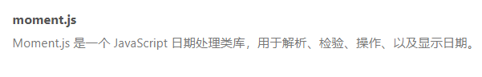

## Vue

### 1、data与el的两种写法

```javascript
# el
1、 const vm=new Vue({
           el:'#app',
           data:{
               name: '尚'
           },
           methods:{}
        });
	data：{
              name: '尚',
           },

2、 vm.$mount("#app")
    data(){
        return{
            name: '尚',
        }
   },


```

**切记：data函数不用箭头函数，箭头函数没有自己的函数，要往外找**

```javascript
# this指vue实例对象 
data(){
               console.log(this);
                return{
                    name: '尚',
                }
},

    
# this指全局window对象
 data:()=>{
               console.log(this);
                return{
                    name: '尚',
                }
           },
```

### 2、MVVM


MVVM模型

+ M：Model：data中的数据
+ V：View：模板代码
+ VM：ViewModel：Vue实例

data中所有的属性，最后都出现在vm身上。

vm身上的所有属性及Vue原型上所有属性，在Vue模板中都可以直接使用。

### 3、数据代理

**Object.defineProperty**

**数据发生变化，setter方法调用，setter中的调用能重新解析模板，生成新的虚拟DOM，新旧DOM对比，更新页面。**


### 4、事件处理

事件修饰符

+ prevent
  + 阻止默认事件
+ stop
  + 阻止事件冒泡
+ once
  + 事件只触发一次
+ capture
  + 使用事件的捕获模式
+ self
  + 只有event.target是当前操作的元素时才触发事件
+ passive
  +  

事件处理流程：捕获(由外向内)--->冒泡(由内向外)


### 5、时间处理第三方库





### 6、生命周期


### 7、组件

